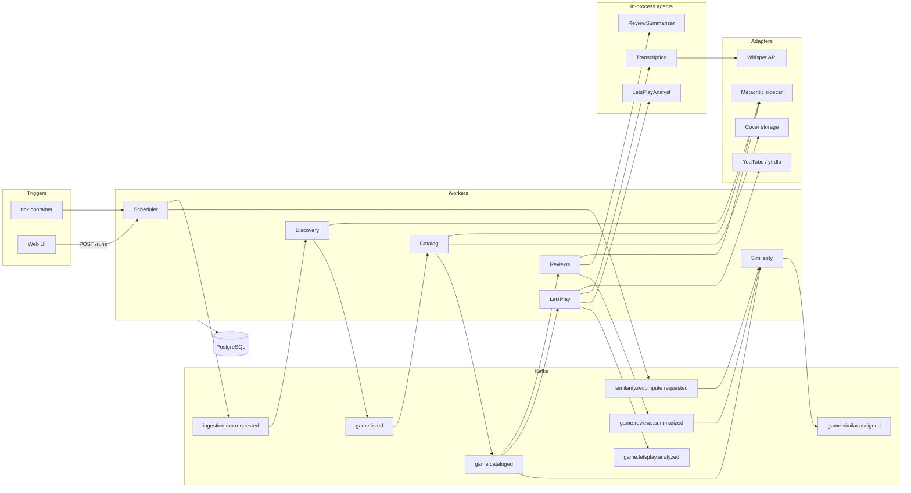

# Games Intel architecture

This document describes how the service is structured: workers, agents, events, storage, scraping, and the UI. Operational commands live in the [README](../README.md). Tunable values live in [`config.example.yaml`](../config.example.yaml); the process loads YAML plus `GAMES_INTEL__SECTION__KEY` env overlay. Code reads the settings object only — no `os.environ` outside `packages/settings`.

## Purpose

Games Intel is a catalog pipeline, not a chat bot with extra steps.

Every calendar day (timezone `app.process_timezone`, default UTC) it ingests Metacritic games that it has not processed yet that day: first the New Releases rail (up to 20), then successive browse-newest pages. For each game it stores a card, critic/user review summaries, similar titles from **its own** database, and an optional YouTube let's-play conclusion. A read-only Query API and React UI serve the catalog and a realtime monitor.

## Design principles

1. **Daemon choreography.** Workers do not know each other. They consume CloudEvents, write a slice of PostgreSQL, and emit the next event via an outbox.
2. **Agents only where a model is required.** Scheduler, Discovery, Catalog, Similarity, adapters, and the API never call LangGraph. Reviews and LetsPlay invoke short in-process agents with structured I/O.
3. **One contract.** Pydantic v2 models generate JSON Schema and AsyncAPI. Kafka values are CloudEvents 1.0. Topic names and `type` strings come from `kafka.events.*`.
4. **Idempotent replicas.** Kafka is at-least-once. Uniqueness is in PostgreSQL (`processed_events`, `idempotency_key`, business unique keys). One consumer group per worker type; distinct `instance_id` per replica.
5. **Partial success.** A failed game or stage does not stop other games or other stages of the same game. Optional data degrades; listing parse/circuit failures are fail-closed.
6. **Untrusted content.** HTML, reviews, and transcripts enter the LLM as truncated data, never as instructions.
7. **Everything changeable is settings.** Event names, cron, group ids, limits, URLs, CSS selectors, model ids.

## Runtime picture



Arrows into agents are library calls, not Kafka.

### Layering

Transport (API, Kafka loop) → services → repositories / adapter ports. LLM lives only in `packages/agents`. SQL stays in `packages/db`. External HTML/JSON never leaks past adapter DTOs.

```text
apps/api/  apps/web/  apps/workers/*  apps/scrape/metacritic/
packages/adapters/*  packages/agents/*  packages/contracts/
packages/db/  packages/kafka/  packages/settings/
infra/compose/
```

## Daily ingest

1. Cron or UI publishes `ingestion.schedule.tick` → SchedulerWorker.
2. First claimed run of the day: New Releases, limit `scheduler.default_limit` (20). Later ticks: browse page `max(last_browse_page, completed/in-flight browse) + 1`. A **failed** listing does not reserve the page; the next tick retries the same page.
3. DiscoveryWorker: canary parse, then listing through MetacriticPort. Drops slugs already in `daily_processed_slugs` for today. One `game.listed` CloudEvent **per game** (Kafka key = slug). `parse_error` / `circuit_open` → cursor stays, run failed (P0). Empty listing still completes the run and advances the cursor.
4. CatalogWorker consumes one game per message. Success or 404 writes `daily_processed_slugs`. Transient sidecar errors retry that game only. Then emit `game.cataloged` (new `traceparent`).
5. Reviews, LetsPlay, and Similarity start from `game.cataloged` in parallel. Similarity also listens to `game.reviews.summarized` when `similarity.recompute_on_reviews` is true.
6. UI reads the projection. Covers are local files at `/api/v1/media/covers/{slug}`.

“Not processed today” means no row in `daily_processed_slugs(process_date, slug)`. Midnight (process timezone) resets the browse cursor.

## Workers

Each worker is a long-lived Python process: poll Kafka → claim item lease → `prepare` (HTTP/LLM) → persist domain + outbox + `processed_events` in one transaction → commit offset. Transient errors backoff without committing. Schema poison and terminal handler failures go to DLQ via the outbox, then offset commit.

| Worker | Kafka in | Kafka out | External I/O | Model |
|--------|----------|-----------|--------------|-------|
| Scheduler | `schedule_tick` | `run_requested`, hourly `similarity_recompute` | none | no |
| Discovery | `run_requested` | `game_listed` | Metacritic listing | no |
| Catalog | `game_listed` | `game.cataloged` | Metacritic card + cover file | no |
| Reviews | `game.cataloged` | `game.reviews.summarized` | Metacritic reviews | ReviewSummarizer |
| LetsPlay | `game.cataloged` | `game.letsplay.analyzed` | YouTube | Transcription (opt) + Analyst |
| Similarity | cataloged, reviews, recompute | `game.similar.assigned` | embeddings HTTP | no LangGraph |

**Scheduler.** Advisory lock + unique in-flight run per `(process_date, source, page)`. Lock miss is a transient retry so `processed_events` is not committed. Duplicate unique-run is a no-op (does not steal the next page). `tick_source=external` (Compose `tick` container) so two scheduler replicas cannot double-fire cron.

**Discovery.** New Releases: up to `discovery.list_limit`. Browse: whole page up to `discovery.browse_list_limit`. Empty page with DOM markers present → success, cursor +1. Missing markers → `parse_error`, cursor frozen. Does **not** write `daily_processed_slugs`.

**Catalog.** Writes title, local cover URL, developer, publisher, genres, release date, description, trailer, platforms + scores. Does not touch review / let's-play columns. Game 404 → that item failed and the slug is marked processed for the day. Sidecar timeout retries the same game.

**Reviews.** Fetches critic then user batches sequentially. Timeout on one side does not drop the other. Empty batches → `degraded`, agent skipped. Otherwise structured summaries in English.

**LetsPlay.** yt-dlp search (`{title} let's play`), take the top hit. Prefer English captions; otherwise download audio and Whisper translations if STT is enabled. No video → `no_video`. No text → `transcript_unavailable`. Analyst returns `conclusion` + `highlights`.

**Similarity.** Hybrid kNN over the local corpus (not Metacritic “similar”). Not an agent.

## Similarity scoring

Canonical embedding text: title, developer, publisher, genres, description, critic/user summaries (if reviews recompute is on). Hash = SHA-256 of that text + model + `vector_dim`. Unchanged hash skips the embedding HTTP call.

For pair `(G, H)`, `H ≠ G`:

| Signal | Default weight |
|--------|----------------|
| Cosine of embeddings, scaled to `[0, 1]` | `w_vector=0.70` |
| Jaccard of platform codes | `w_platform=0.15` |
| Jaccard of genres | `w_genre=0.10` |
| `exp(-|release_days| / 365)`; missing date → signal omitted | `w_release=0.05` |

Stored `similar_games.score` is the **hybrid** score. Self-links are forbidden by schema. Top-K: `similarity.k` (default 5).

**`incremental` (default).** Top-K for G, then reverse-refresh a neighbor candidate set. Full `scope=all` recompute is also published by Scheduler on `similarity.full_recompute_cron`.

**`inline_all`.** On cataloged/reviews: upsert G's vector, then rebuild `similar_games` for every game that has an embedding in one transaction (capped by `inline_all_max_rows`).

Below `similarity.hnsw_min_rows`, search is a sequential scan. No embedding → stage `degraded`, empty list, not failed.

## Agents

An agent is a short procedure the worker calls **after** deterministic collection. It does not read Kafka or hit Metacritic/YouTube.

| Agent | Input | Output | Provider |
|-------|-------|--------|----------|
| ReviewSummarizer | truncated critic/user snippets | `ReviewSummary` × 2 | OpenRouter chat |
| Transcription | audio ref from YouTubePort | English text | OpenAI Whisper translations |
| LetsPlayAnalyst | truncated transcript | conclusion + highlights | OpenRouter chat |

Prompts are files under `packages/agents/*/prompts/` with an explicit output contract. Graphs are a few structured-output nodes, no tools. LangGraph `PostgresSaver` is used **only** in Reviews/LetsPlay so an expensive successful LLM call survives a crash before persist. `thread_id` = `{run_id}:{slug}:{agent_name}:{input_digest}`.

## Events

Envelope: CloudEvents 1.0 JSON. Required: `id` (UUIDv7), `source`, `type`, `time`, `datacontenttype`, `dataschema`, `subject`, `idempotencykey`, `data`. Extensions: `runid`, `traceparent`.

`idempotencykey` is deterministic: `{event_type}:{run_id}:{subject}:{stage}` from `idempotency.key_template`.

| Topic / type | Producer | Consumers |
|--------------|----------|-----------|
| `ingestion.schedule.tick` | tick container, Query API | Scheduler |
| `ingestion.run.requested` | Scheduler | Discovery |
| `game.listed` | Discovery | Catalog |
| `game.cataloged` | Catalog | Reviews, LetsPlay, Similarity |
| `game.reviews.summarized` | Reviews | Similarity |
| `game.letsplay.analyzed` | LetsPlay | (DB projection) |
| `game.similar.assigned` | Similarity | (DB projection) |
| `similarity.recompute.requested` | Scheduler / Similarity | Similarity |
| `worker.heartbeat` | every worker | monitor snapshot |
| `ingestion.dlq` | any consumer | operator |

Kafka message key = slug for game topics, `run_id` for control topics. Partition counts: `kafka.partitions.game_events` (must be ≥ replica count of game-stage workers) and `kafka.partitions.control`.

Source of truth: `packages/contracts`. Generate schemas with `python -m games_intel.contracts.generate`.

## Data model

Stable game key: `metacritic_slug`, not title. Each worker updates **its own columns** through a repository method. Timestamps are `timestamptz` UTC. Domain write and outbox insert share one transaction.

| Table | Role |
|-------|------|
| `games` | Card + review summaries + let's play + `vector` embedding |
| `game_platforms` | `(game_id, platform_code)`, metascore / userscore |
| `similar_games` | `(game_id, similar_game_id)`, hybrid score + rank |
| `ingestion_cursors` | Per `process_date`: new-releases done, last browse page |
| `ingestion_runs` | One run per tick; unique in-flight `(process_date, source, page)` |
| `ingestion_items` | Per game/stage status, attempts, sanitized error |
| `daily_processed_slugs` | Catalog (success/404) “already seen today” |
| `processed_events` | `(worker_type, event_id)` and `(worker_type, idempotency_key)` |
| `outbox` | Unpublished CloudEvents; relay claims with a lease, then produces after commit |
| `worker_heartbeats` | `(worker_type, instance_id)` |
| `external_page_cache` | Sidecar HTML TTL cache |
| `adapter_health` | Metacritic circuit / parse streak |

Query API is read-only except inserting a manual tick into the outbox. UI search uses `pg_trgm` on `games.title`. Sort by rating uses `max(metascore)` across platforms, `NULLS LAST`.

Schema changes only via Alembic (`packages/db`). Compose applies migrations in the `migrate` service.

## Scraping

Playwright runs in `apps/scrape/metacritic` and speaks HTTP JSON. Workers use `MetacriticPort`. Selectors and DOM **markers** are settings.

- Markers present, zero games → empty page success, cursor +1.
- Marker missing → `parse_error`, cursor frozen, no `game.listed`.
- Golden HTML: `tests/fixtures/metacritic/`. Parser tests never hit the network. A layout change means update selectors **and** fixtures.
- Page cache TTL (`adapters.metacritic.cache_ttl_seconds`) so retries do not hammer the site.
- Circuit breaker: `circuit_fail_threshold` / `circuit_open_seconds`. Open circuit is Transient for the worker and P0 on the monitor.
- Canary slug (default `elden-ring`) before listing.
- Covers are stored on a volume; the UI does not depend on Metacritic CDN.

## Errors and recovery

| Class | Retry | Offset | Item | DLQ |
|-------|-------|--------|------|-----|
| Transient (timeout, 429, 5xx, circuit open) | yes, backoff | not until limit | then `failed` | after limit |
| Business 404 | no | commit | `failed` | no |
| Empty reviews / no video / no captions | no | commit | `degraded` | no |
| Parse / missing DOM markers | no infinite | commit after fail | listing run `failed` | handler |
| Poison CloudEvent schema | no | commit after DLQ | domain untouched | yes |

Retry settings: `retry.max_attempts`, exponential backoff, jitter. Agents retry only the model/STT call, not site HTTP.

After a process crash: consumer resumes from the last committed offset. Duplicate delivery is a no-op via `processed_events`. Outbox relay produces with a stable CloudEvents `id`. Agent checkpoint avoids paying for LLM twice if persist had not finished.

**Run now** is a **new** tick (same page rule as cron), not a retry of a single slug.

## Replicas

Two Catalog (or Reviews, …) containers share `kafka.consumer_groups.catalog` and differ by `instance_id`. A partition is owned by one member; after rebalance the second delivery hits the unique idempotency row and commits. Using **different** group ids would duplicate every message — that is a misconfiguration.

Outbox `producer` is `worker_type`, not instance, so any replica can finish unpublished rows.

## Query API and UI

Base path `/api/v1`. Routers validate, call a service, return. No LLM, no RPC to workers.

| Method | Path | Role |
|--------|------|------|
| GET | `/games` | `q`, `platform`, `sort`, `order`, pagination |
| GET | `/games/{slug}` | Full card + `hydration` per stage |
| GET | `/platforms` | Filter dictionary |
| GET | `/media/covers/{slug}` | Local cover |
| GET | `/monitor` | Runs, items, workers |
| GET | `/monitor/stream` | SSE of the same snapshot |
| POST | `/runs` | Manual tick, 202 |
| GET | `/healthz` `/readyz` | Liveness / Postgres (+ Kafka) |

Errors: RFC 7807. UI is English. Missing fields use idle / loading / empty / error, not a single “collecting…” string. Similar-game names navigate to that card. Client types are generated from OpenAPI (`apps/web/src/api/schema.d.ts`).

Monitor draws one DAG per `ingestion_runs` row: Start → Collect Metacritic cards → fan-out reviews / let's play / similar per game. **Run now** is disabled while the POST is in flight.

## Configuration

Load order: `APP_CONFIG_PATH` YAML, then env overlay. Unknown keys fail startup (strict). Secrets (`database.url`, `llm.api_key`, `stt.api_key`, Kafka password) are empty in git examples.

Chat and embeddings share OpenRouter (`llm.base_url`, `embeddings.base_url`). Whisper uses OpenAI (`stt.base_url`). YouTube `api_key` is unused leftover for overlay compatibility.

Kafka on the Compose stand is SASL PLAIN for client listeners; inter-broker stays PLAINTEXT (single KRaft node).

## Decisions worth knowing

- **Pipeline = Kafka daemons, not one LangGraph.** Scraping and SQL are deterministic Python. Agents are small structured-output graphs inside two workers.
- **Metacritic = Playwright sidecar**, not in-process browsers in every replica. One Chromium pool, shared cache and circuit.
- **YouTube = yt-dlp InnerTube**, not Data API v3. No Google quota, no extra runtime. Breaks are fixed by bumping yt-dlp, not a custom parser. 429 is `rate_limited` (retry), not `quota_exceeded`.
- **Embeddings via OpenRouter**; **STT via OpenAI** because OpenRouter does not expose Whisper translations.
- **Exactly-once is not claimed.** At-least-once + unique keys is the recovery model.

## Quality attributes

| Attribute | How |
|-----------|-----|
| Scale | Worker replicas, configurable partitions, idempotent handlers |
| Performance | Catalog / reviews / let's play in parallel; LLM only on truncated text |
| Reliability | Typed errors, outbox, DLQ, fail-closed listing |
| Recoverability | Offset + items + outbox; agent checkpoint |
| Security | Secrets in env; Kafka SASL on the stand; untrusted LLM inputs |
| Observability | Structured logs with `run_id` / `slug` / worker; SSE monitor |
| Testability | Fake ports, golden HTML, no network and no real LLM in unit tests |
