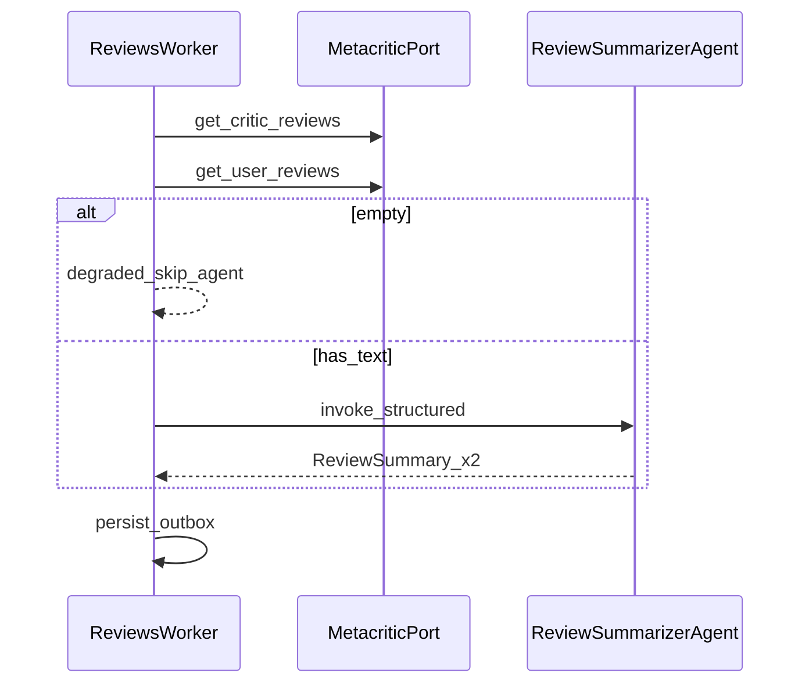

# Agent Catalog

**Status**: Existing
**Last Updated**: 2026-09-09
**Stakeholders**: AI Engineer, Backend
**Related Docs**: [../workers/worker-catalog.md](../workers/worker-catalog.md), [../reliability/error-handling.md](../reliability/error-handling.md), [../events/event-contracts.md](../events/event-contracts.md)

## Purpose

Каталог компонентов, где нужна языковая или STT-модель. Агент — короткая процедура, которую вызывает воркер после детерминированного сбора данных. Агент не знает о Kafka, соседних воркерах, URL Metacritic и YouTube.

## Key Principles

- Агент используется, только если без модели нельзя получить результат (резюме, транскрипт без субтитров, заключение по тексту).
- Стек LLM-агентов: LangChain + LangGraph + structured output по Pydantic из `packages/contracts`. TranscriptionAgent вызывает SttPort.
- Промпты — файлы-шаблоны с контрактом вывода. Вход — урезанные фрагменты как data, не как инструкции.
- Идемпотентность на уровне воркера: агент может быть вызван повторно с теми же входами; воркер не эмитит второе событие.
- `thread_id` checkpoint: `{run_id}:{slug}:{agent_name}`, длина < 255. PostgresSaver **только** здесь, не у демонов.

## Components & Interactions

Воркер передаёт DTO, получает DTO. Нет адаптеров сайтов в агенте.

---

### Component: ReviewSummarizerAgent

**Responsibility**: По фрагментам отзывов критиков и пользователей вернуть структурированное резюме «что нравится / нет».

**Interfaces**: Python `ainvoke(ReviewSummarizerInput) -> ReviewSummarizerOutput`. Не Kafka.

**Dependencies**: OpenRouter chat (`llm.model`, `llm.api_key`); шаблоны промптов. Нет Port к сайтам.

**Scaling**: in-process с ReviewsWorker.

**Failure Modes**: timeout/5xx модели — retry агента; невалидная схема — `retry.llm_structure_retries`; после лимита воркер ставит stage failed. Пустой вход воркер сюда не передаёт.

Вход: два списка `ReviewSnippet`. Выход: `critic: ReviewSummary`, `user: ReviewSummary` (`likes`, `dislikes`, `summary`). Язык резюме: русский.

Граф: два параллельных node structured output (`summarize_critic`, `summarize_user`) без tools. Реализация: `packages/agents/review_summarizer`.

---

### Component: TranscriptionAgent

**Responsibility**: Перевести речь летсплея в текст, если YouTubePort не вернул субтитры.

**Interfaces**: `ainvoke(TranscriptionInput { audio_ref }) -> { text, language }`.

**Dependencies**: SttPort из `packages/adapters/stt` (OpenAI Whisper API). Агент не ходит на YouTube Data API; `audio_ref` уже получен воркером через `get_audio`.

**Scaling**: in-process с LetsPlayWorker.

**Failure Modes**: STT выключен — воркер не вызывает агента, `transcript_unavailable`. STT fail — retry затем degrade. Долгое аудио отсекается лимитом длительности **до** вызова.

OpenAI Whisper API (`stt.model`, default `whisper-1`). Это единственное место, где «аудио → текст» делается моделью: один вызов SttPort.

Скачивание медиа — YouTubePort, не TranscriptionAgent.

---

### Component: LetsPlayAnalystAgent

**Responsibility**: По тексту рассказа блогера дать заключение и highlights.

**Interfaces**: `ainvoke({ video_title, transcript_excerpt }) -> LetsPlayConclusion { conclusion, highlights }`.

**Dependencies**: LLM, промпт-шаблон. Нет Port к сайтам, нет поиска роликов.

**Scaling**: in-process с LetsPlayWorker.

**Failure Modes**: как у ReviewSummarizer. Слишком длинный транскрипт режет **воркер** до `TRANSCRIPT_MAX_CHARS` до вызова.

Язык заключения: русский.

---

### Что агентом не является

| Компонент | Почему не агент |
|-----------|-----------------|
| Scheduler / Discovery / Catalog | чистая детерминированная логика + Port |
| SimilarityWorker | embedding + hybrid SQL kNN, без рассуждения |
| Поиск летсплея, captions, get_audio | YouTubePort, детерминировано |
| SttPort (OpenAI Whisper API) | вызывается из TranscriptionAgent, отдельного Kafka-демона нет |
| Outbox relay, Query API, cron | инфраструктура |

## Diagrams / Visuals

См. [worker-catalog.md](../workers/worker-catalog.md) — агенты как внутренние вызовы Reviews/LetsPlay.

## Trade-offs & Justifications

- Агенты не подписаны на Kafka: иначе ИИ-слой тащит consumer, retry Kafka и адаптеры сайтов, хотя его задача — преобразовать текст в схему.
- Три маленьких агента лучше одного «game intelligence graph»: короче, тестируемее, падение STT не ломает резюме отзывов.
- STT по умолчанию включён (Whisper API). Субтитры YouTube — основной путь; STT только если их нет.
- Чат и эмбеддинги — OpenRouter (`google/gemini-2.5-flash-lite`, `openai/text-embedding-3-small` с `dimensions=768`).

## Technical Details

- **Technology Stack**: LangGraph StateGraph для резюме и заключения; TranscriptionAgent — SttPort без графа; LangChain `ChatOpenAI` против **OpenRouter** (structured output `json_schema`); повторы только LangGraph `RetryPolicy` / `retry.llm_structure_retries`; Pydantic structured output; PostgresSaver только у LLM-агентов.
- **Configuration & Env Vars**: [configuration.md](../core/configuration.md) — `llm.*`, `stt.*`, `letsplay.stt_enabled`, пути промптов.
- **Dependencies & Versions**: langchain/langgraph только в пакетах агентов и в Reviews/LetsPlay images.
- **Testing Strategy**: фикстуры входа → ожидаемый Pydantic; fake LLM; повтор invoke не проверяет Kafka (это тест воркера).
- **Deployment Considerations**: код агента в `packages/agents/`; процесс — воркер. Ключ OpenRouter — `GAMES_INTEL__LLM__API_KEY`. Whisper — отдельный `GAMES_INTEL__STT__API_KEY` на OpenAI.

## Quality Attributes

Minimal agent surface, structured I/O, traceability of expensive calls, isolation from scraping failures.
