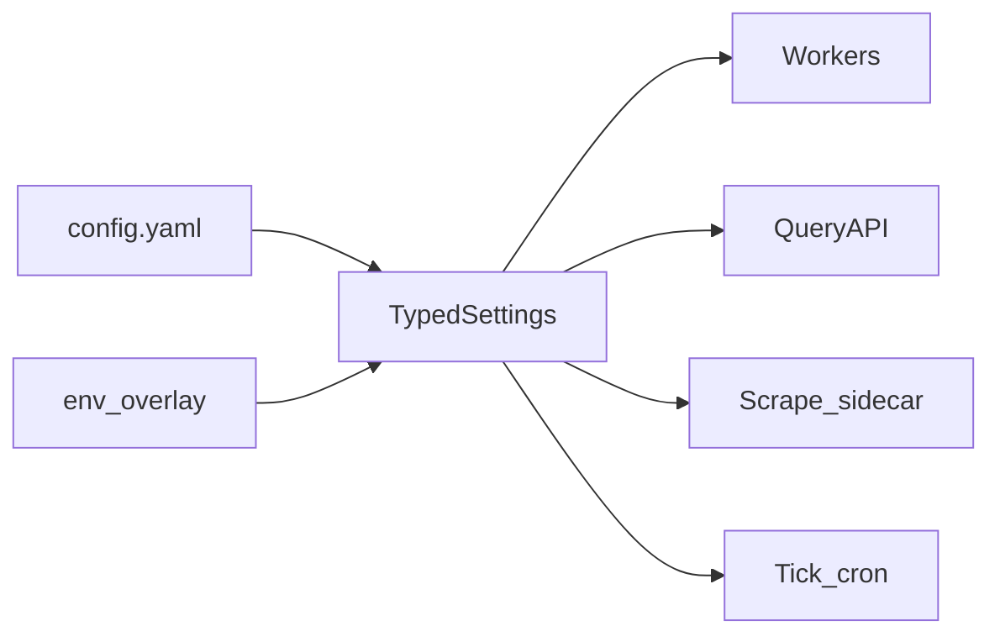

# Configuration

**Status**: Existing
**Last Updated**: 2026-09-09
**Stakeholders**: AI Engineer, Backend, Frontend, Ops
**Related Docs**: [system-architecture.md](system-architecture.md), [../workers/replicas-and-idempotency.md](../workers/replicas-and-idempotency.md), [../events/event-contracts.md](../events/event-contracts.md)

## Purpose

Единый канон конфигурации. **Всё изменяемое** задаётся типизированными settings (`packages/settings`), не литералами в коде: имена событий и топиков, cron первого воркера, consumer group, число партиций, лимиты, таймауты, URL, модели, селекторы адаптера — любой параметр, который может отличаться между стендами или со временем.

Код читает только объект настроек. `os.environ` вне слоя settings запрещён. В репозитории — `.env.example` / `config.example.yaml` с пустыми секретами.

## Key Principles

1. Один дерево настроек на процесс (воркер, API, scrape sidecar). Процесс загружает **весь** нужный ему срез; неизвестные ключи — ошибка старта (strict).
2. Имена CloudEvents `type`, топиков Kafka и consumer group — строки из конфига, не Python-константы «навсегда».
3. Реплики одного воркера получают **одинаковый** `consumer_group` и **разный** `instance_id`.
4. Секреты только env/secret store; нелогируемые.
5. Defaults в коде settings-класса; стенд перекрывает yaml+env.

Загрузка: yaml файл (`APP_CONFIG_PATH`) + overlay переменных `GAMES_INTEL__SECTION__KEY` (вложенность через `__`).

## Components & Interactions

Ниже — логическая схема. Имена ключей — канон для реализации Pydantic Settings.

### `app`

| Key | Default | Смысл |
|-----|---------|--------|
| `name` | `games-intel` | префикс URN `source` |
| `env` | `local` | `local`/`staging`/`prod` |
| `log_level` | `INFO` | |
| `process_timezone` | `UTC` | календарный день выборки |
| `http_timeout_seconds` | `30` | дефолт внешних вызовов |

### `kafka`

| Key | Default | Смысл |
|-----|---------|--------|
| `bootstrap_servers` | `localhost:9092` | |
| `client_id` | `{app.name}-{worker.type}-{instance_id}` | |
| `security_protocol` | `SASL_PLAINTEXT` | стенд и клиенты Compose; в проде обычно `SASL_SSL`, те же username/password |
| `sasl_mechanism` | `PLAIN` | |
| `sasl_username` | `kafka` | |
| `sasl_password` | empty in yaml | только env overlay (`GAMES_INTEL__KAFKA__SASL_PASSWORD`); обязателен для Compose |

Клиентские слушатели брокера (`BROKER` в Docker-сети, `HOST` на localhost) — SASL PLAIN. Inter-broker/controller остаются PLAINTEXT (один узел KRaft). Без логина/пароля клиент на `:29092` / `:9092` не подключается.
| `partitions.game_events` | `6` | партиции топиков игр; ≥ ожидаемых реплик Catalog/Reviews/LetsPlay/Similarity |
| `partitions.control` | `3` | tick/run/dlq/heartbeat/similarity.recompute |
| `replication_factor` | `1` | на демо |
| `retention_hours` | `168` | replay |
| `enable_auto_commit` | `false` | всегда false |
| `max_poll_records` | `10` | |
| `max_poll_interval_ms` | `600000` | > худшего handler с retry |
| `session_timeout_ms` | `45000` | |

**Имена событий и топиков** (type = topic, значения меняются только здесь):

| Key | Default |
|-----|---------|
| `events.schedule_tick` | `ingestion.schedule.tick` |
| `events.run_requested` | `ingestion.run.requested` |
| `events.page_listed` | `games.page.listed` | одна страница listing; Catalog грузит все карточки одним сообщением |
| `events.game_cataloged` | `game.cataloged` | карточка готова; Reviews/LetsPlay/Similarity стартуют отсюда |
| `events.game_cataloged` | `game.cataloged` |
| `events.game_reviews_summarized` | `game.reviews.summarized` |
| `events.game_letsplay_analyzed` | `game.letsplay.analyzed` |
| `events.game_similar_assigned` | `game.similar.assigned` |
| `events.similarity_recompute` | `similarity.recompute.requested` |
| `events.worker_heartbeat` | `worker.heartbeat` |
| `events.dlq` | `ingestion.dlq` |

**Consumer groups** (общее на все реплики данного типа воркера):

| Key | Default |
|-----|---------|
| `consumer_groups.scheduler` | `games-intel.scheduler` |
| `consumer_groups.discovery` | `games-intel.discovery` |
| `consumer_groups.catalog` | `games-intel.catalog` |
| `consumer_groups.reviews` | `games-intel.reviews` |
| `consumer_groups.letsplay` | `games-intel.letsplay` |
| `consumer_groups.similarity` | `games-intel.similarity` |

Смена group = «прочитать топик заново» (осторожно). Реплики **не** получают уникальный group.

`topic_prefix` (default empty): если задан, к каждому `events.*` добавляется префикс стенда.

### `idempotency`

| Key | Default | Смысл |
|-----|---------|--------|
| `key_template` | `{event_type}:{run_id}:{subject}:{stage}` | детерминированный ключ операции |
| `enable_event_id_unique` | `true` | unique CloudEvents `id` |
| `enable_business_key_unique` | `true` | unique по шаблону выше |

`stage` для события задаётся в конфиге воркера (`workers.*.stage_name`).

### `scheduler`

| Key | Default | Смысл |
|-----|---------|--------|
| `tick_source` | `external` | `external` — отдельный cron шлёт `events.schedule_tick`; `in_process` — цикл внутри воркера |
| `tick_cron` | `0 * * * *` | расписание при `in_process` или для cron-контейнера |
| `tick_interval_seconds` | `3600` | альтернатива cron, если задан и `tick_use_interval=true` |
| `tick_use_interval` | `false` | |
| `advisory_lock_key` | `742001` | pg advisory lock, чтобы две реплики Scheduler не открыли два run |
| `tick_dedup_window_seconds` | `300` | unique tick в окне |
| `default_limit` | `20` | игр за run |
| `new_releases_source` | `new_releases` | значение поля `source` в событии |
| `browse_source` | `browse` | |

Первый воркер суток: не хардкод «час», а `tick_cron` / interval. Ручной запуск UI — тот же event type из `events.schedule_tick`. Scheduler также по `similarity.full_recompute_cron` публикует `events.similarity_recompute` (`scope=all`); это не вызов Similarity по имени, а событие из конфига.

### `discovery` / `catalog` / `reviews` / `letsplay` / `similarity`

Общее на каждый воркер:

| Key | Смысл |
|-----|--------|
| `enabled` | выключить стадию без пересборки |
| `consumer_group` | ссылка на `kafka.consumer_groups.*` |
| `subscribe_event` | ключ из `kafka.events.*` |
| `publish_event` | исходящий тип/топик |
| `stage_name` | `discovered` / `cataloged` / … для idempotency и items |
| `heartbeat_interval_seconds` | |
| `instance_id` | env `HOSTNAME` / uuid; **разный** у реплик |
| `lease_seconds` | опциональный row-lock на item (default 120) |

Специфика:

- `discovery.list_limit` — New Releases за run (совпадает с `scheduler.default_limit`)
- `discovery.browse_list_limit` — потолок карточек одной browse-страницы (страница Metacritic ~24; не резать до 20)
- `catalog.empty_video_ok` default true
- `reviews.critic_limit`, `user_limit`, `max_chars`, `skip_agent_if_empty`
- `letsplay.search_max_results`, `stt_enabled`, `transcript_max_chars`, `max_video_duration_seconds`
- `similarity.k`, `mode` (`inline_all` \| `incremental`), `inline_all_max_rows` (2000), `recompute_on_reviews` (bool)
- `similarity.w_vector` / `w_platform` / `w_genre` / `w_release`, `release_tau_days` (365)
- `similarity.full_recompute_cron` (`15 * * * *`), `reverse_candidate_limit` (50), `hnsw_min_rows` (5000), `emit_assigned_for_all` (false)

### `retry`

| Key | Default |
|-----|---------|
| `max_attempts` | `5` |
| `backoff_base_seconds` | `1` |
| `backoff_max_seconds` | `60` |
| `jitter_ratio` | `0.2` |
| `llm_structure_retries` | `2` |

### `database`

`url`, `pool_size`, `pool_timeout_seconds`, `auto_migrate` (false в prod).

### `adapters.metacritic`

Sidecar HTTP. Селекторы, маркеры fail-closed, пути — **здесь**, не в воркере.

| Key | Default | Смысл |
|-----|---------|--------|
| `base_url` | `https://www.metacritic.com` | |
| `sidecar_base_url` | `http://scrape-metacritic:8080` | клиент воркера |
| `mode` | `sidecar` | `sidecar` \| `in_process` (тесты) |
| `timeout_seconds` | `30` | |
| `min_delay_ms` | `1500` | пауза между навигациями |
| `user_agent` | Chrome desktop UA | Playwright; бот-строка часто режется WAF |
| `locale` | `en-US` | Playwright locale |
| `headless` | `true` | |
| `pool_size` | `1` | вкладки/браузеры |
| `new_releases_path` / `browse_path` / `browse_page_query_param` | | |
| `cache_ttl_seconds` | `3600` | ключ кеша — `url_hash`; устаревший HTML вытесняется TTL |
| `canary_enabled` | `true` | |
| `canary_slug` | задать в yaml | известная карточка |
| `circuit_fail_threshold` | `3` | |
| `circuit_open_seconds` | `600` | |
| `markers.*` | | обязательные селекторы listing/card |

Селекторы listing/card/reviews — ключи под `adapters.metacritic.selectors.*`.

### `adapters.youtube`

`api_key`, `timeout_seconds`, `search_query_template` (`{title} let's play`), `min_duration_seconds` (180), `max_duration_seconds` (7200), `exclude_title_patterns` (compilation, top 10, …). Сортировка по просмотрам **после** фильтра релевантности.

### `media`

`covers_dir` (volume), `covers_url_prefix` (`/api/v1/media/covers`), `covers_cache_control` (`public, max-age=86400`). Query API отдаёт обложки только с volume; Cache-Control задаётся здесь, не копируется с Metacritic.

### `stt`

OpenAI Whisper API (`POST /v1/audio/transcriptions`). У OpenRouter нет transcriptions, поэтому STT остаётся на `api.openai.com`. Ключ не берётся из `llm.api_key`, если origin другой.

| Key | Default | Смысл |
|-----|---------|--------|
| `enabled` | `true` (зеркало `letsplay.stt_enabled`) | воркер вызывает STT, только если субтитров нет |
| `timeout_seconds` | `120` | HTTP-таймаут Whisper |
| `model` | `whisper-1` | модель OpenAI Audio Transcriptions |
| `base_url` | `https://api.openai.com/v1` | |
| `api_key` | `""` | `GAMES_INTEL__STT__API_KEY`; не шарится с OpenRouter |

`enabled=false` — порт не вызывается воркером; летсплей без субтитров остаётся `transcript_unavailable`.

### `llm` / `embeddings`

Канон стенда — **OpenRouter** (чат и эмбеддинги, один ключ). Клиент — OpenAI-совместимый (`ChatOpenAI` / `POST /embeddings`).

| Key | Default | Смысл |
|-----|---------|--------|
| `llm.model` | `google/gemini-2.5-flash-lite` | дешёвая быстрая модель для резюме и заключения; structured outputs |
| `llm.base_url` | `https://openrouter.ai/api/v1` | |
| `llm.api_key` | `""` | ключ OpenRouter; overlay `GAMES_INTEL__LLM__API_KEY` |
| `llm.temperature` | `0` | |
| `llm.timeout_seconds` | `60` | |
| `llm.max_tokens` | `512` | |
| `embeddings.model` | `openai/text-embedding-3-small` | через OpenRouter; `dimensions=vector_dim` |
| `embeddings.base_url` | `https://openrouter.ai/api/v1` | пустой → `llm.base_url` |
| `embeddings.api_key` | `""` | пустой → `llm.api_key` |
| `embeddings.vector_dim` | `768` | колонка `games.embedding`; смена — миграция + rebuild |

Пустой `llm.model` или `llm.api_key` по-прежнему не валит старт Reviews/LetsPlay: процесс шлёт heartbeat; вызов агента — `LlmStructureError` (без retry).

Промпты: `prompts.review_summarizer_path`, `letsplay_analyst_path` — пути к единственному актуальному шаблону каждого агента.

### `api` / `web`

`api.host`, `port`, `cors_origins`, `heartbeat_stale_seconds`, `page_size_default`, `page_size_max`.

`web.api_base_url` — абсолютный адрес Query API для стендов. SPA читает `VITE_API_BASE_URL` (default `/api/v1` за reverse-proxy на тот же origin).

### `monitor`

`monitor.heartbeat_stale_seconds`, показ `instance_id` реплик, `scrape.circuit_state` / last parse_error в снимке монитора, `sse_poll_seconds` (интервал опроса БД для SSE).

## Diagrams / Visuals

Ни один из W/API/Sidecar не читает сырой env.

## Trade-offs & Justifications

Дерево yaml+env вместо россыпи констант: смена имени топика, часа запуска и group id — операция конфига, не релиз логики. Strict parse ловит опечатки на старте.

## Technical Details

- **Technology Stack**: Pydantic Settings v2, yaml.
- **Configuration & Env Vars**: этот документ и есть канон ключей.
- **Dependencies & Versions**: один пакет `packages/settings`.
- **Testing Strategy**: тест «все воркеры берут topic из settings»; тест «две реплики с разным group — запрещённый антипаттерн задокументирован»; snapshot example-конфига.
- **Deployment Considerations**: Compose подставляет env; секреты не в git.

## Quality Attributes

Changeability, safety (strict), 12-factor, одинаковый конфиг на N реплик кроме `instance_id`.
