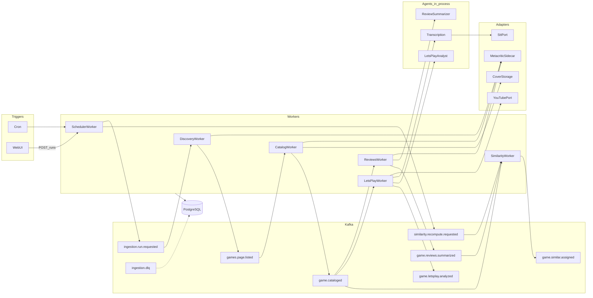
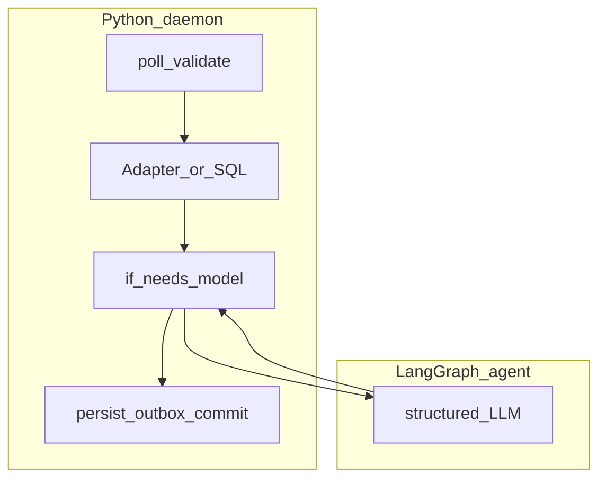

# Metacritic Games Intelligence — System Architecture

**Status**: Existing
**Last Updated**: 2026-09-09
**Stakeholders**: AI Engineer, Backend, Frontend, QA
**Related Docs**: [../index.md](../index.md), [task.md](../../../task.md), [configuration.md](configuration.md), [../workers/worker-catalog.md](../workers/worker-catalog.md), [../workers/similarity.md](../workers/similarity.md), [../workers/replicas-and-idempotency.md](../workers/replicas-and-idempotency.md), [../agents/agent-catalog.md](../agents/agent-catalog.md), [../reliability/error-handling.md](../reliability/error-handling.md), [../reliability/recovery.md](../reliability/recovery.md), [../events/event-contracts.md](../events/event-contracts.md), [../database/data-model.md](../database/data-model.md), [../integrations/adapters.md](../integrations/adapters.md), [../integrations/scraping-resilience.md](../integrations/scraping-resilience.md), [../frontend/web-ui.md](../frontend/web-ui.md)

## Purpose

Сервис раз в час забирает с Metacritic до 20 игр, ещё не обработанных в текущих календарных сутках, сохраняет карточку, резюме отзывов, похожие игры и анализ летсплея YouTube, отдаёт веб-UI и realtime-монитор воркеров с кнопкой запуска.

Система — набор автономных **демонов-воркеров** на Kafka. LangChain/LangGraph — только там, где без модели нельзя (резюме отзывов, опциональный STT, заключение по транскрипту). Чат и эмбеддинги — OpenRouter; расшифровка аудио — OpenAI Whisper API.

Ограничения:

1. Воркеры автономны, не знают друг о друге; взаимодействие только через Kafka.
2. Детерминированные шаги — простой Python-демон, не LangGraph.
3. Агент — короткая процедура внутри Reviews/LetsPlay, structured I/O, без Kafka и без HTTP к сайтам.
4. Результаты и этап хранятся в PostgreSQL; после сбоя работа продолжается с последнего устойчивого этапа.
5. Внешние API/HTML — типизированные адаптеры (HTTP sidecar для Playwright). Контракты — CloudEvents 1.0 + Pydantic/JSON Schema. Шина между воркерами — Kafka.

## Key Principles

1. **Хореография демонов.** Нет супервизора по именам воркеров.
2. **Агенты по необходимости.** Нет модели в Scheduler, Discovery, Catalog, Similarity, адаптерах, API.
3. **Единый контракт.** Pydantic v2 → JSON Schema → CloudEvents `data` (и structured output агентов). Имена `type`/топиков — из конфига.
4. **Идемпотентность и реплики.** Одна consumer group на тип воркера; Kafka at-least-once недостаточно. Обязательны `idempotency_key` и unique в БД. См. [replicas-and-idempotency.md](../workers/replicas-and-idempotency.md).
5. **Частичный успех и явная политика ошибок.** См. [error-handling.md](../reliability/error-handling.md).
6. **Недоверенный контент** в LLM только как data, урезанные фрагменты.
7. **Всё изменяемое в settings.** Имена событий, cron тика, group id, лимиты, URL, селекторы адаптера. См. [configuration.md](configuration.md). `os.environ` вне слоя settings запрещён.

## Components & Interactions

### Контейнеры (C4)

| Component | Kind | Responsibility | Failure Modes |
|-----------|------|----------------|---------------|
| SchedulerWorker | daemon | tick → run + similarity.recompute по cron | гонка той же страницы → unique, иначе следующая страница |
| DiscoveryWorker | daemon | canary + listing 20 игр | listing/parse/circuit → курсор стоит |
| CatalogWorker | daemon | карточка + локальная обложка | 404 → item failed |
| ReviewsWorker | daemon + agent | отзывы адаптером, резюме агентом | пустые отзывы → degraded, без агента |
| LetsPlayWorker | daemon + agents | поиск/субтитры адаптером, STT/заключение агентами | нет ролика/субтитров → degraded |
| SimilarityWorker | daemon | hybrid kNN + reverse refresh | нет соседей → пустой список |
| ReviewSummarizerAgent | agent | structured резюме | retry LLM; не читает Kafka |
| TranscriptionAgent | agent | аудио → текст через SttPort | выкл. по флагу |
| LetsPlayAnalystAgent | agent | заключение по транскрипту | retry LLM |
| Query API / Web UI | — | чтение, SSE, POST tick, media | 503 если БД |
| Metacritic scrape sidecar | adapter HTTP | Playwright, кеш, circuit | timeout/parse_error/circuit → воркеру |
| YouTube / STT / media adapters | adapter lib | API, captions, Whisper API, файлы | quota/timeout → воркеру/агенту |
| OpenRouter | external | chat, embeddings | 401/429/5xx → воркеру/агенту |
| OpenAI Whisper | external | audio transcriptions | 401/429/5xx → LetsPlay |
| Kafka / PostgreSQL | infra | шина, состояние | см. recovery |

Query API не вызывает LLM и не дергает воркеров по RPC — только outbox tick (`kafka.events.schedule_tick` из конфига). Full recompute похожих шлёт Scheduler по своему cron как CloudEvent, не API.

### Реплики

Две копии одного воркера (например Catalog) допустимы: общий `kafka.consumer_groups.catalog`, разный `instance_id`. Сообщение в стабильном состоянии обрабатывает одна реплика (партиции group). Дубли при rebalance/рестарте отсекаются unique `idempotency_key`. Подробности и почему одной Kafka мало — [replicas-and-idempotency.md](../workers/replicas-and-idempotency.md).

Число партиций `kafka.partitions.game_events` должно быть ≥ числа реплик стадий игр.

### Конфигурация

Полное дерево ключей: [configuration.md](configuration.md). В коде нет литералов топиков, cron (`0 * * * *` живёт в `scheduler.tick_cron`), лимита 20 (`scheduler.default_limit`), имён стадий.

### Поток за сутки

1. Cron или UI → `ingestion.schedule.tick` → SchedulerWorker.
2. Первый заход дня: New Releases; далее browse newest постранично. Курсор в БД, timezone конфигурируема (default UTC).
3. DiscoveryWorker: canary + listing через MetacriticPort (20 New Releases или полная browse-страница), фильтр «сегодня уже брали» (`daily_processed_slugs`), одно событие `games.page.listed`. Parse_error/circuit — курсор стоит.
4. CatalogWorker грузит **все карточки страницы одним сообщением** (один task/trace), затем на каждую успешную карточку публикует `game.cataloged`.
5. Reviews, LetsPlay и Similarity стартуют **после карточки**: каждое `game.cataloged` — отдельная задача и отдельный `traceparent`. Similarity пересчитывает свой top-K и чужие списки (и по reviews, если включено). См. [similarity.md](../workers/similarity.md).
6. UI читает проекцию; обложки с `/api/v1/media/covers/{slug}`; неполная карточка нормальна.

### Обработка ошибок (обзор)

Полная матрица: [error-handling.md](../reliability/error-handling.md). Рестарт процесса: [recovery.md](../reliability/recovery.md).

Кратко:

- **Transient** (timeout, 429, 5xx): backoff, `attempt_count` в БД, offset не commit; после лимита — item failed + optional DLQ.
- **Business** (404, пустые отзывы, нет субтитров): без retry-цикла; failed или degraded; соседи продолжают.
- **Poison schema**: DLQ, commit, партиция жива.
- **Listing не получен**: курсор не двигается, run failed, час/кнопка повторит ту же страницу. Включая `parse_error` и `circuit_open`.
- **Сбой одной игры** не валит run и не останавливает другие стадии этой игры.
- Агент ретраит только модель; retry внешнего I/O — в демоне и sidecar.

### Выборка Metacritic

- Первый прогон дня: https://www.metacritic.com/game/ — New Releases, до 20.
- Далее: https://www.metacritic.com/browse/game/all/all/all-time/new/ — очередная страница.
- «Сегодня не обрабатывал» = нет `daily_processed_slugs(process_date, slug)`.
- Смена суток сбрасывает browse-курсор.

### Репозиторная раскладка

```
apps/api/
apps/web/
apps/workers/scheduler/
apps/workers/discovery/
apps/workers/catalog/
apps/workers/reviews/
apps/workers/letsplay/
apps/workers/similarity/
apps/scrape/metacritic/
packages/adapters/metacritic/
packages/adapters/youtube/
packages/adapters/media/
packages/adapters/stt/
packages/agents/review_summarizer/
packages/agents/transcription/
packages/agents/letsplay_analyst/
packages/contracts/
packages/db/
packages/kafka/
packages/settings/
infra/compose/
```

Зависимости: transport → services → repositories. LLM только `packages/agents`. Scheduler/Discovery/Catalog/Similarity **не** зависят от langchain.

## Diagrams / Visuals

### Хореография воркеров



### Цикл демона vs агент



## Trade-offs & Justifications

Пайплайн — демоны на Kafka, агенты только для модели. Внешний мир — Port и scrape sidecar. Имена шины и расписание — конфиг. Реплики безопасны за счёт group + idempotency key: брокер даёт at-least-once, уникальность операции — в PostgreSQL. Похожие игры пересчитываются для всего корпуса с эмбеддингом.

## Technical Details

### Technology Stack

- Python 3.12, uv; LangChain/LangGraph **только агенты**; чат — `ChatOpenAI`
- FastAPI, SQLAlchemy 2, Alembic, Pydantic v2
- Typed adapter ports; Playwright в Metacritic sidecar (HTTP JSON)
- OpenAI Whisper API в SttPort
- Kafka 3.x KRaft, PostgreSQL 16 + pgvector
- React + TS + Vite + TanStack Query
- Docker Compose

### Configuration & Env Vars

Полный канон ключей: [configuration.md](configuration.md). Секреты (`DATABASE_URL`, API keys) — только env overlay. В этом файле литералы не дублируются.

### Dependencies & Versions

Pin в lock-файле. Обязательны: валидация CloudEvents, outbox, JSON Schema. `langgraph-checkpoint-postgres` — только образы Reviews/LetsPlay.

### Testing Strategy

- Демоны: handler + fake Port, идемпотентность, матрица ошибок, reverse similarity.
- Агенты: structured output, без Kafka.
- Recovery: kill до/после persist, unpublished outbox, attempt_count.
- Без сети и без реального LLM в unit.

### Deployment Considerations

Контейнер на воркер (replicas в Compose), scrape sidecar, api, web, postgres, kafka, volume обложек и Kafka log dir. Postgres и Kafka — `restart: unless-stopped`. Воркеры, API и sidecar ждут healthy Postgres+Kafka (и migrate/kafka-init), затем ретраят готовность БД/брокера при старте, чтобы пережить рестарт Docker Desktop. Один cron-контейнер при `scheduler.tick_source=external`. Health/ready: Postgres + Kafka; sidecar `/healthz`.

## Quality Attributes

| Attribute | Strategy |
|-----------|----------|
| Scalability | реплики воркера, партиции из конфига, идемпотентность |
| Performance | параллель catalog/reviews/letsplay; LLM только на тексте |
| Reliability | error-handling.md + outbox + DLQ |
| Recoverability | offset + items + outbox; checkpoint агентов |
| Security | секреты в env; Kafka SASL PLAIN на стенде; недоверенный контент |
| Observability | логи `run_id`/`slug`/`worker`; SSE монитора |
| Maintainability | контракты; селекторы в адаптере; без графа на скрейпинге |

## Implementation Plan

1. Контракты, миграции, каркас демона.
2. Metacritic sidecar + Discovery/Catalog workers + обложки + fail-closed listing.
3. Reviews worker + ReviewSummarizerAgent + error tests.
4. Similarity (inline_all + hybrid) + UI.
5. LetsPlay worker + SttPort + агенты.
6. Monitor SSE (включая circuit), ручной запуск, recovery-тесты.

Откат: воркеры независимы; миграции обратимы либо irreversible явно.
