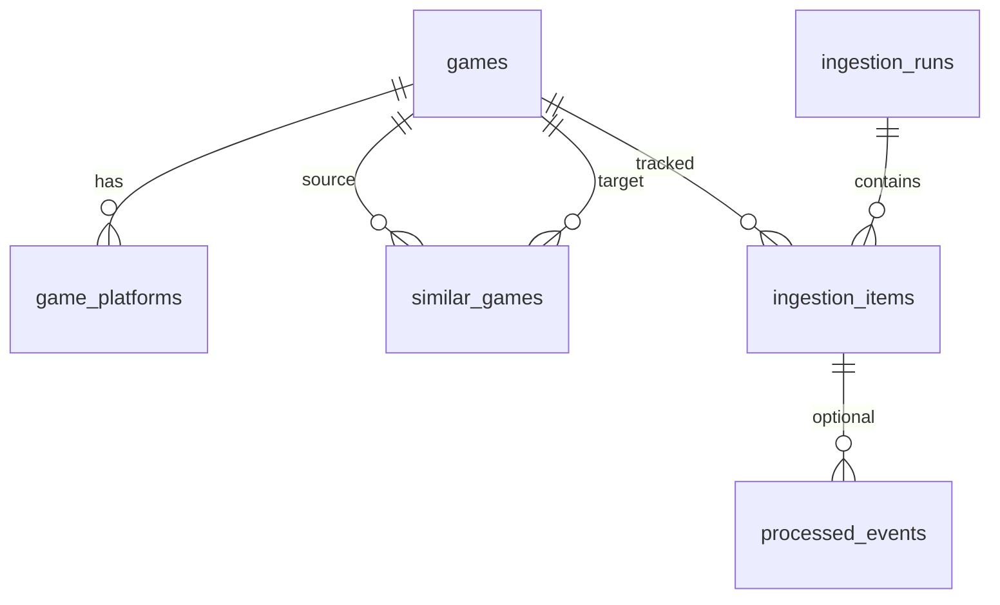
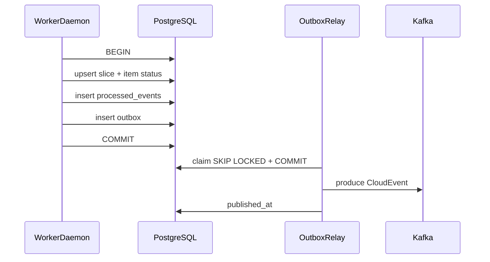

# Data Model

**Status**: Existing
**Last Updated**: 2026-09-09
**Stakeholders**: AI Engineer, Backend
**Related Docs**: [../events/event-contracts.md](../events/event-contracts.md), [../workers/replicas-and-idempotency.md](../workers/replicas-and-idempotency.md), [../reliability/error-handling.md](../reliability/error-handling.md), [../reliability/recovery.md](../reliability/recovery.md), [../core/configuration.md](../core/configuration.md)

## Purpose

Описать PostgreSQL как единственное прикладное хранилище: карточки игр, срезы стадий, курсор суток, outbox, heartbeats, pgvector, чекпоинты LangGraph. Схема меняется только миграциями Alembic.

## Key Principles

- Стабильный ключ игры — `metacritic_slug`, не title.
- Обновление среза не затирает чужие колонки: каждый **воркер** пишет свой набор полей через repository-метод, не `UPDATE games SET *`.
- Все timestamps — `timestamptz` UTC.
- Домен + outbox в одной транзакции.
- Идемпотентность на уникальных ключах, не на «проверить-потом-вставить» без constraint.
- Запись домена — только из репозиториев воркеров; Query API — read-only + insert tick в outbox.

## Components & Interactions

### ER (логика)

### Таблица `games`

| Column | Type | Notes |
|--------|------|--------|
| `id` | uuid PK | внутренний |
| `metacritic_slug` | text UNIQUE NOT NULL | канон |
| `title` | text NOT NULL | |
| `listing_url` | text | |
| `cover_url` | text NULL | локальный путь API |
| `cover_source_url` | text NULL | оригинал Metacritic |
| `developer` | text NULL | catalog |
| `publisher` | text NULL | catalog |
| `genres` | jsonb NOT NULL default `[]` | catalog, список строк |
| `release_date` | date NULL | catalog |
| `description` | text NULL | catalog |
| `video_url` | text NULL | catalog trailer |
| `critic_likes` | jsonb NULL | reviews |
| `critic_dislikes` | jsonb NULL | |
| `critic_summary` | text NULL | |
| `user_likes` | jsonb NULL | |
| `user_dislikes` | jsonb NULL | |
| `user_summary` | text NULL | |
| `letsplay_status` | text NULL | enum в check |
| `letsplay_video_url` | text NULL | |
| `letsplay_video_title` | text NULL | |
| `letsplay_view_count` | int NULL | |
| `letsplay_conclusion` | text NULL | |
| `letsplay_highlights` | jsonb NULL | |
| `embedding` | vector NULL | similarity |
| `embedding_input_hash` | text NULL | SHA-256 канона + модель |
| `created_at` | timestamptz | |
| `updated_at` | timestamptz | любой срез |

`letsplay_status` check: `ok | no_video | transcript_unavailable | quota_exceeded`.

### Таблица `game_platforms`

- PK `(game_id, platform_code)`
- `metascore` int NULL, `userscore` numeric NULL
- Catalog делает replace набора платформ игры в той же транзакции, что update `games`.

### Таблица `similar_games`

- PK `(game_id, similar_game_id)`
- `score` double precision — **hybrid**
- `score_vector` double precision NULL — сырой cosine для отладки
- `rank` int
- FK на `games(id)` оба конца; запрет `game_id = similar_game_id`
- SimilarityWorker удаляет старый набор и вставляет новый в одной транзакции (для одной игры или для всех в `inline_all`). Алгоритм — [similarity.md](../workers/similarity.md).

### Таблица `ingestion_cursors`

- PK `process_date` (date)
- `new_releases_done` bool
- `last_browse_page` int NULL
- `updated_at`

Scheduler читает/пишет только эту таблицу + `ingestion_runs`.

### Таблица `ingestion_runs`

| Column | Type |
|--------|------|
| `id` | uuid PK = `run_id` |
| `process_date` | date |
| `source` | text |
| `page` | int NULL |
| `limit` | int |
| `trigger` | text |
| `status` | `requested \| running \| completed \| failed` |
| `discovered_count` | int default 0 |
| `started_at` / `completed_at` | timestamptz NULL |

        Unique: не более одного **in-flight** run (`requested` \| `running`) на `(process_date, source, page)` — и для cron, и для manual. Следующий tick (ручной или cron) резервирует **следующую** страницу: `max(last_browse_page, страницы non-failed runs)+1`. Два тика подряд не открывают одну и ту же страницу. После `failed` ту же страницу можно открыть снова (курсор не двигался). `started_at` ставится в момент создания run (тик).

### Таблица `ingestion_items`

| Column | Type | Notes |
|--------|------|--------|
| `id` | uuid | |
| `run_id` | FK | |
| `game_id` | FK | |
| `metacritic_slug` | text | |
| `process_date` | date | |
| `stage` | text | |
| `status` | text | `pending \| running \| completed \| failed \| degraded` |
| `attempt_count` | int default 0 | Transient-попытки; переживает рестарт процесса |
| `error_type` / `error_message` | text NULL | без секретов и сырого HTML |
| `event_id` | text NULL | CloudEvents `id` |
| `updated_at` | timestamptz | |

Unique `(process_date, metacritic_slug)` для факта «уже брали сегодня» — ставится на stage `discovered` (одна строка-якорь на игру в сутки) **или** отдельная таблица `daily_processed_slugs(process_date, slug)` PK. Предпочтение: `daily_processed_slugs`, чтобы стадии не плодили ложные unique.

**`daily_processed_slugs`**: PK `(process_date, metacritic_slug)` — пишет только Discovery.

Unique стадий: `(run_id, metacritic_slug, stage)` — повтор той же стадии no-op.

Stages: `discovered`, `cataloged`, `reviews`, `letsplay`, `similar`.

### Таблица `processed_events`

| Column | Notes |
|--------|--------|
| `worker_type` | часть PK; Catalog/Reviews/LetsPlay могут обработать один и тот же CloudEvent |
| `event_id` | CloudEvents `id`; unique **вместе с** `worker_type` |
| `idempotency_key` | ключ операции; unique **вместе с** `worker_type` |
| `type`, `consumed_at`, `instance_id` | |

PK `(worker_type, event_id)`. Unique `(worker_type, idempotency_key)`. Conflict по любой из этих пар **внутри одного** `worker_type` → no-op. Две реплики Catalog не выполняют handler дважды; Reviews, LetsPlay и Similarity на том же `game.cataloged` работают независимо.

### Таблица `outbox`

| Column | Type | Notes |
|--------|------|--------|
| `id` | bigserial | |
| `producer` | text NOT NULL | `worker_type` (не instance): любая реплика догоняет unpublished |
| `idempotency_key` | text UNIQUE | исходящая операция |
| `topic` | text | из конфига |
| `partition_key` | text | slug или run_id |
| `payload` | jsonb | полный CloudEvent |
| `created_at` | timestamptz | |
| `published_at` | timestamptz NULL | |

Relay: короткий `SELECT … FOR UPDATE SKIP LOCKED` unpublished-строк (`producer = worker_type`), COMMIT, Kafka send вне транзакции, затем `published_at`.

### Таблица `worker_heartbeats`

- PK `(worker_type, instance_id)` — две реплики Catalog видны раздельно
- `status`, `current_subject`, `processed_ok`, `processed_failed`, `lag_hint`, `observed_at`

### LangGraph checkpoints

Таблицы создаёт `PostgresSaver.setup()` **только в процессах Reviews/LetsPlay** (агенты). Чистые демоны эти таблицы не трогают. `thread_id` < 255.

### Таблица `external_page_cache`

Кеш HTML sidecar. PK `url_hash`. `fetched_at`, `body`, `content_type`, `http_status`. Пишет только scrape sidecar. См. [scraping-resilience.md](../integrations/scraping-resilience.md).

### Таблица `adapter_health`

Одна строка на адаптер (`metacritic`). `circuit_state`, `parse_error_streak`, `opened_at`, `last_parse_error_at`, `updated_at`. Query API читает для монитора.

### Индексы и поиск UI

- `games.title` — `pg_trgm` GIN для поиска по названию
- `game_platforms.platform_code` — фильтр
- expression/index для сортировки: `GREATEST` metascore по платформам — через query join + `ORDER BY max(metascore) NULLS LAST`
- `games.embedding` — sequential scan до `similarity.hnsw_min_rows`; затем hnsw cosine
- `games.genres` — GIN по jsonb для чтения и hybrid-скоринга

### Репозитории (границы)

| Repository | Writer | Reads |
|------------|--------|-------|
| `GameCatalogRepository` | CatalogWorker | API |
| `GameReviewsRepository` | ReviewsWorker | API |
| `GameLetsPlayRepository` | LetsPlayWorker | API |
| `SimilarGamesRepository` | SimilarityWorker | API |
| `IngestionRepository` | Scheduler, Discovery, все воркеры (свой stage) | API monitor |
| `OutboxRepository` | все writers | relay |

SQL не покидает пакет `packages/db`.

## Diagrams / Visuals

Транзакция воркера:

## Trade-offs & Justifications

- Одна БД на домен и пайплайн: для тестового объёма (20 игр/час) проще, чем event store + отдельные read DB. При росте read-модель остаётся теми же таблицами.
- JSONB для likes/dislikes: список строк из LLM, без отдельной сущности.
- Эмбеддинг в `games`: kNN и карточка в одном запросе. SimilarityWorker пересчитывает `similar_games` для корпуса по правилам [similarity.md](../workers/similarity.md).
- `daily_processed_slugs` отдельно от items: правило «сегодня уже брали» не зависит от числа стадий.
- Обложка локально: UI не зависит от TTL CDN.

## Technical Details

- **Technology Stack**: PostgreSQL 16, `vector`, `pg_trgm`, SQLAlchemy 2.0, Alembic.
- **Configuration & Env Vars**: [configuration.md](../core/configuration.md) — `database.*`, `similarity.*`, `embeddings.vector_dim`, `media.*`.
- **Dependencies & Versions**: драйвер async (`asyncpg`); расширение `CREATE EXTENSION vector; CREATE EXTENSION pg_trgm;` в миграции 0001.
- **Testing Strategy**: миграции с нуля; unique slug/day; unique `(worker_type, idempotency_key)` при параллельных insert; тот же `event_id` для Catalog и Reviews — оба inserted; reviews не затирает cover; outbox в одной транзакции с rollback; две игры взаимно в similar после второго cataloged.
- **Deployment Considerations**: volume Postgres в Compose. Embedding dimension из `embeddings.vector_dim` (768, `text-embedding-3-small` с `dimensions=768`); смена ширины — миграция (0004) + rebuild, irreversible явно.

## Quality Attributes

Integrity (FK, unique), recoverability (outbox + items), query performance (trgm, hnsw), minimality (нет второй БД на демо).
