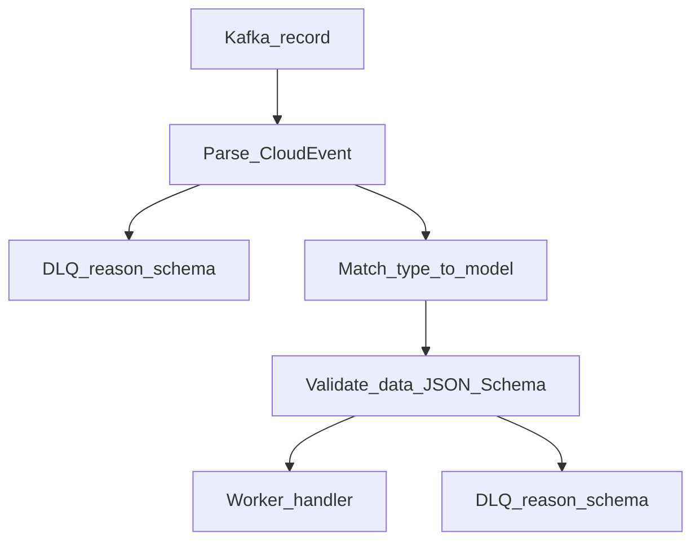
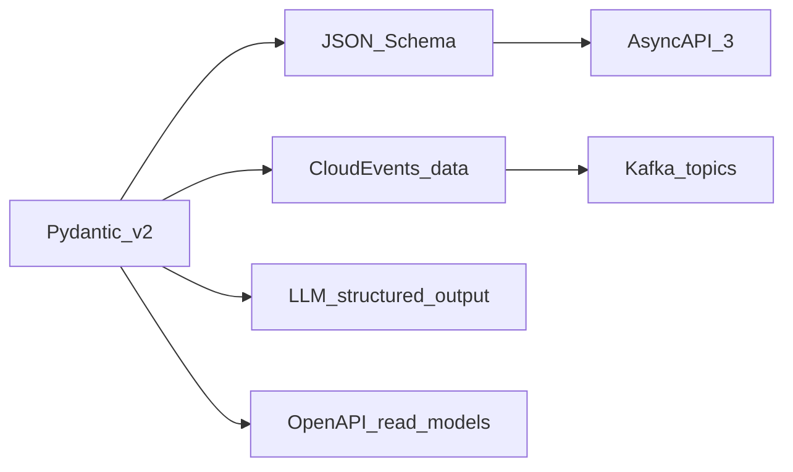

# Event Contracts

**Status**: Existing
**Last Updated**: 2026-09-09
**Stakeholders**: AI Engineer, Backend, Frontend
**Related Docs**: [../workers/worker-catalog.md](../workers/worker-catalog.md), [../workers/replicas-and-idempotency.md](../workers/replicas-and-idempotency.md), [../core/configuration.md](../core/configuration.md), [../agents/agent-catalog.md](../agents/agent-catalog.md), [../database/data-model.md](../database/data-model.md)

## Purpose

Задать **единый** формат входов и выходов воркеров на Kafka и structured output агентов: конверт CloudEvents 1.0, канонические Pydantic-модели (= JSON Schema), топики, валидация, DLQ и AsyncAPI. Другого «внутреннего JSON как получится» нет.

## Key Principles

1. Source of truth — пакет `packages/contracts` (Pydantic v2). JSON Schema и фрагменты AsyncAPI **генерируются** из моделей, не пишутся вторым руками.
2. Kafka message value — CloudEvents JSON. Ключ сообщения Kafka = `subject` (slug) или `run_id` — из конфига правила ключа.
3. Имя топика и поле `type` берутся из `kafka.events.*`, в коде не хардкодятся. По умолчанию совпадают.
4. Эволюция только аддитивная. Версия в `dataschema`.
5. Невалидный конверт — DLQ. См. [error-handling.md](../reliability/error-handling.md).
6. Обязательны `id` **и** `idempotencykey` (детерминированный ключ операции). См. [replicas-and-idempotency.md](../workers/replicas-and-idempotency.md).

## Components & Interactions

### Конверт CloudEvents 1.0

Обязательные поля:

| Field | Rule |
|-------|------|
| `specversion` | `"1.0"` |
| `id` | UUIDv7; уникальность **сообщения** шины |
| `source` | `urn:{app.name}:worker:{worker_type}` или `…:api` |
| `type` | значение из `kafka.events.*` |
| `time` | RFC 3339 UTC |
| `datacontenttype` | `application/json` |
| `dataschema` | URL версии схемы payload |
| `subject` | `metacritic_slug` или `run_id` |
| `idempotencykey` | детерминированно `{event_type}:{run_id}:{subject}:{stage}` по `idempotency.key_template` |
| `data` | объект против схемы `type` |

Расширения: `runid`, `traceparent` (W3C). `idempotencykey` обязателен (не опционален).

Имена в таблице ниже — **defaults из конфига**; код читает `settings.kafka.events`.

### Каталог топиков

| Topic / `type` | Producer | Consumers | `data` model |
|----------------|----------|-----------|--------------|
| `ingestion.schedule.tick` | Cron sidecar, Query API | SchedulerWorker | `ScheduleTick` |
| `ingestion.run.requested` | SchedulerWorker | DiscoveryWorker | `RunRequested` |
| `games.page.listed` | DiscoveryWorker | CatalogWorker | `GamesPageListed` |
| `game.cataloged` | CatalogWorker | Reviews, LetsPlay, Similarity | `GameCataloged` |
| `game.reviews.summarized` | ReviewsWorker | SimilarityWorker | `GameReviewsSummarized` |
| `game.letsplay.analyzed` | LetsPlayWorker | — (проекция в БД) | `GameLetsPlayAnalyzed` |
| `game.similar.assigned` | SimilarityWorker | — | `GameSimilarAssigned` |
| `similarity.recompute.requested` | Scheduler (cron), SimilarityWorker (incremental neighbors) | SimilarityWorker | `SimilarityRecomputeRequested` |
| `worker.heartbeat` | каждый воркер | Query API / monitor sink | `WorkerHeartbeat` |
| `ingestion.dlq` | любой consumer | оператор, алерт | `DeadLetter` |

Партиционирование: карточка/отзывы/летсплей/похожие — Kafka key = slug; tick/run/page_listed/recompute-all — `run_id`. Число партиций — `kafka.partitions.*` (`page_listed` на control). Replication/retention — конфиг. `similarity.recompute.requested` при `scope=all` — control partitions.

### Payload-модели (канон)

Поля timezone-aware datetime — UTC. Числа скоров — `int | null` (Metacritic tbd → null).

**ScheduleTick**

- `trigger`: `cron` \| `manual`
- `requested_at`: datetime
- `process_date`: date (календарный день выборки в `PROCESS_TIMEZONE`)

**RunRequested**

- `run_id`: UUID
- `process_date`: date
- `source`: `new_releases` \| `browse`
- `page`: int \| null (`null` для new_releases)
- `limit`: int (default 20, max из settings)
- `trigger`: `cron` \| `manual`

**GamesPageListed**

- `run_id`: UUID
- `process_date`: date
- `source`: `new_releases` \| `browse`
- `page`: int \| null
- `games`: list[`ListedGame`] (`metacritic_slug`, `title`, `listing_url`, `position`)

**PlatformScore**

- `platform_code`: str (`ps5`, `pc`, `ns2`, …) — нормализованный код из адаптера, не свободный текст агента
- `metascore`: int \| null
- `userscore`: float \| null

**GameCataloged**

- `run_id`: UUID
- `process_date`: date
- `metacritic_slug`: str
- `title`: str
- `cover_url`: str \| null (путь/URL локальной обложки, не hotlink)
- `cover_source_url`: HttpUrl \| null
- `developer`: str \| null
- `publisher`: str \| null
- `genres`: list[str]
- `release_date`: date \| null
- `description`: str \| null
- `video_url`: HttpUrl \| null
- `platforms`: list[`PlatformScore`] (min 0)

**ReviewSummary**

- `likes`: list[str]
- `dislikes`: list[str]
- `summary`: str

**GameReviewsSummarized**

- `run_id`: UUID
- `metacritic_slug`: str
- `critic`: ReviewSummary
- `user`: ReviewSummary
- `critic_review_count`: int
- `user_review_count`: int
- `degraded`: bool

**GameLetsPlayAnalyzed**

- `run_id`: UUID
- `metacritic_slug`: str
- `status`: `ok` \| `no_video` \| `transcript_unavailable` \| `quota_exceeded`
- `video_url`: HttpUrl \| null
- `video_title`: str \| null
- `view_count`: int \| null
- `conclusion`: str \| null
- `highlights`: list[str]

**SimilarGameRef**

- `metacritic_slug`: str
- `title`: str
- `score`: float (hybrid score, не сырой cosine)
- `rank`: int (1..K)

**GameSimilarAssigned**

- `run_id`: UUID
- `metacritic_slug`: str
- `items`: list[`SimilarGameRef`]

**SimilarityRecomputeRequested**

- `run_id`: UUID \| null
- `process_date`: date
- `scope`: `game` \| `neighbors` \| `all`
- `center_slug`: str \| null
- `candidate_slugs`: list[str] (пусто при `scope=all`)
- `reason`: `cataloged` \| `reviews` \| `schedule` \| `manual`

**WorkerHeartbeat**

- `worker_type`: str
- `instance_id`: str
- `status`: `idle` \| `running` \| `error`
- `current_subject`: str \| null
- `processed_ok`: int
- `processed_failed`: int
- `lag_hint`: int \| null
- `observed_at`: datetime

**DeadLetter**

- `original_topic`: str
- `original_id`: str
- `reason`: `schema` \| `handler` \| `timeout`
- `error_type`: str
- `error_message`: str (без секретов и PII)
- `payload_truncated`: bool

LLM structured output использует **подмножество**: `ReviewSummary`, объект заключения летсплея (`conclusion`, `highlights`). Разбор свободного текста запрещён.

### Валидация на границе

- Consumer не коммитит offset до записи DLQ при schema fail (чтобы не потерять яд) **либо** коммитит после успешной записи DLQ — выбирается второе: яд не блокирует партицию.
- `id` пишется в `processed_events(worker_type, event_id)` unique; повтор **тому же** типу воркера — ack без работы. Другой тип воркера на том же `id` (Reviews vs LetsPlay vs Similarity на `game.cataloged`) обрабатывает событие сам.

### AsyncAPI 3.0

Файл `contracts/asyncapi.yaml` генерируется в CI из Pydantic. Минимальная модель:

- `servers.kafka` — bootstrap из settings
- `channels.{type}` — messages.$ref на JSON Schema payload, wrapped CloudEvents
- `operations` — send/receive по воркерам без указания «кого вызывать»

HTTP API документируется OpenAPI 3 из тех же доменных read-моделей (не из CloudEvents). Read-модели каталога — проекции, но поля игр совпадают с catalog/reviews/letsplay схемами, чтобы UI не видел второй язык.

## Diagrams / Visuals

## Trade-offs & Justifications

CloudEvents JSON + обязательный `idempotencykey`: масштабирование реплик и повторная доставка не плодят стадии. Имена type/topic — конфиг.

## Technical Details

- **Technology Stack**: Pydantic v2, CloudEvents 1.0, JSON Schema, AsyncAPI 3.0.
- **Configuration & Env Vars**: [configuration.md](../core/configuration.md) — `kafka.events.*`, prefix, partitions, `idempotency.key_template`.
- **Dependencies & Versions**: lock uv.
- **Testing Strategy**: golden JSON; required `idempotencykey`; DLQ на битом конверте; два события с разным `id` и одним business key.
- **Deployment Considerations**: init-контейнер создаёт топики из конфига.

## Quality Attributes

Interoperability (CNCF CloudEvents), correctness (schema gate), evolvability (additive), debuggability (`id`, `source`, `subject`, `runid`).
