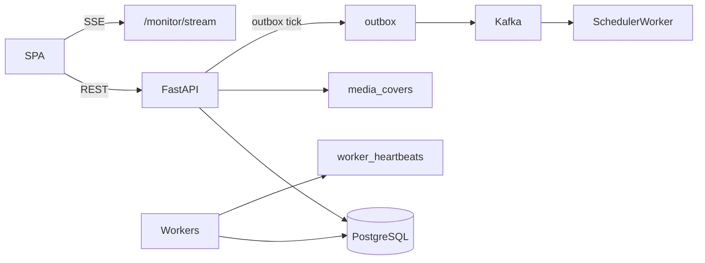

# Web UI

**Status**: Existing
**Last Updated**: 2026-09-09
**Stakeholders**: Frontend, Backend
**Related Docs**: [../core/system-architecture.md](../core/system-architecture.md), [../core/configuration.md](../core/configuration.md), [../workers/replicas-and-idempotency.md](../workers/replicas-and-idempotency.md), [../database/data-model.md](../database/data-model.md), [../events/event-contracts.md](../events/event-contracts.md), [../reliability/error-handling.md](../reliability/error-handling.md)

## Purpose

Веб-интерфейс каталога игр и операторский монитор пайплайна: список, карточка, фильтр платформ, поиск по названию, сортировка по рейтингу, похожие игры, граф задач каждого запуска, кнопка принудительного запуска.

## Key Principles

- Функциональные компоненты React; серверное состояние — TanStack Query, не ручной fetch в `useEffect` без слоя API.
- Типы клиента генерируются из OpenAPI FastAPI. Ручное дублирование DTO запрещено.
- Каждый экран: loading, empty, error.
- Доступность: клавиатура, ARIA, `prefers-reduced-motion`.
- UI на английском; исходные title/description с Metacritic — как пришли.
- Запуск пайплайна = CloudEvent типа `kafka.events.schedule_tick` (`trigger=manual`) через API/outbox. UI не знает имён воркеров и не показывает replica `instance_id`.
- Плоские цвета, без градиента фона; рамки панелей и карточек контрастные (2px).

## Components & Interactions

### Query API (FastAPI) — контракт для UI

База `/api/v1`. Только валидация входа, вызов сервиса чтения/тика, ответ.

| Method | Path | Назначение |
|--------|------|------------|
| GET | `/games` | Список: `q`, `platform`, `sort=metascore\|userscore\|title\|updated`, `order`, `page`, `page_size` |
| GET | `/games/{slug}` | Карточка + platforms + genres + release_date + summaries + letsplay + similar |
| GET | `/platforms` | Справочник кодов для фильтра |
| GET | `/media/covers/{slug}` | Локальная обложка; 404 если нет файла |
| GET | `/monitor` | Снимок: runs суток, `items` (стадии игр), workers/counts/cursor/scrape (для API; UI графа использует runs+items) |
| GET | `/monitor/stream` | SSE тех же кадров (heartbeat / item updates) |
| POST | `/runs` | Ручной запуск; 202 + `run_accepted` |
| GET | `/healthz` | liveness |
| GET | `/readyz` | Postgres (+ опционально Kafka) |

Ошибки: RFC 7807 problem+json. 404 slug. 503 если БД нет.

Сортировка по рейтингу: `max(metascore)` по платформам, `NULLS LAST`; fallback UI может переключить на userscore. Поиск: `ILIKE` / `pg_trgm` по `title`. Фильтр платформ: наличие строки в `game_platforms`.

POST `/runs` не ждёт воркеров. Тело опционально пустое; сервер ставит `process_date` из timezone settings.

### Экраны

**Список игр**

- Краткая карточка: обложка, title, developer (отдельный pill), агрегированный Metascore, платформы-чипы.
- Контролы: поиск, chip-фильтр платформ, chip-группа сортировки.
- Клик по карточке → `/games/{slug}`.
- Empty: "No games yet" + ссылка на монитор/запуск.

**Карточка игры**

- Полный набор из task.md: название, обложка (локальный `/media/covers/{slug}`), платформы+Metascore+Userscore, разработчик, описание, ссылка на видео (если null — скрыть блок). Жанр (чипы) и дата выхода отображаются, если поля заполнены.
- Блоки резюме критиков и пользователей (likes/dislikes/summary). Если ещё нет — состояние "Collecting reviews".
- Графическая ссылка на карточку игры на Metacritic (slug → `/game/{slug}/`).
- Let's play: ссылка на ролик + заключение; статусы `no_video` / `transcript_unavailable` — понятный текст, не ошибка страницы.
- Похожие: список из БД (hybrid score); клик по имени открывает карточку той игры. Self нет. После catalog/reviews и hourly recompute списки согласованы по всему корпусу.
- Частичная гидратация нормальна: polling Query или invalidate по SSE `game.{slug}` hint.

**Монитор (доп. 2)**

- Один граф на каждый `ingestion_runs` за сутки (Airflow-подобный DAG). Корень: Start pipeline. Первая задача: Collect Metacritic cards. Далее веер по каждой игре: Collect reviews, Collect let's play, Find similar games.
- У узла: статус и таймер (сколько задача уже активна или за сколько завершилась). У заголовка графа — дата **и** время запуска (`started_at`).
- Легенда статусов: requested, pending, running, completed, degraded, failed.
- Ошибки (`error_type`, `error_message`) — в диалоге по клику на failed/degraded задачу. Сообщения проходят `sanitize_error_message`.
- Не показывать replica `instance_id`, курсор суток, scrape circuit panel, таблицу stage/status counts, список "runs today" отдельной секцией (граф и есть run).
- Кнопка "Run now": disabled пока POST in-flight; toast 202; тот же tick и то же правило страниц, что hourly cron (пустой день → new releases; после страницы N → N+1). Пустой completed run: «No new games this run», не «Waiting for game cards».
- Не показывать секреты, промпты, сырые транскрипты целиком.

### Клиентская архитектура

```
apps/web/src/
  api/          generated client + Query keys
  pages/        list, game, monitor
  components/   GameCard, PlatformFilter, SimilarList, RunDag, StatusLegend
```

Query keys включают фильтры. SSE на мониторе обязателен; на карточке — опциональный invalidate.

### Доступность и состояния

- Фокус-видимость, кнопки-кнопки, `aria-live` для тостов запуска и для смены статуса воркера (без шторма: debounce).
- `prefers-reduced-motion`: без бесконечных skeleton-shimmer анимаций.
- Изображения обложек: `alt` = title.

## Diagrams / Visuals



## Trade-offs & Justifications

- SSE из API (чтение БД), не браузер→Kafka: не светим брокер, проще auth на демо.
- Снимок монитора в Postgres, обновляемый heartbeats: переживает рестарт UI.
- Генерация типов из OpenAPI, не из CloudEvents: UI говорит языком проекций, не шины.

## Technical Details

- **Technology Stack**: React, TypeScript, Vite, TanStack Query, React Router; FastAPI, pydantic-settings.
- **Configuration & Env Vars**: [configuration.md](../core/configuration.md) — `web.*`, `api.*`, `monitor.*`. Клиент читает `VITE_API_BASE_URL` (в dev/prod reverse-proxy это `/api/v1`, соответствует `web.api_base_url`).
- **Dependencies & Versions**: lock npm/uv; codegen openapi-typescript или эквивалент в CI.
- **Testing Strategy**: API-тесты фильтров/сортировки на фикстурах БД; контракт OpenAPI; UI empty/error хотя бы компонентно. Каталог проверен в браузере против stub API (`npm run dev:stub`). Монитор: items в снимке, POST `/runs` → outbox, SSE кадр, UI граф запуска и диалог ошибки.
- **Deployment Considerations**: nginx/caddy: `/` static, `/api` proxy. Не кэшировать `/monitor`.

## Quality Attributes

Usability (частичные данные), accessibility, operability (монитор+кнопка), consistency (одни типы с бэкендом).
