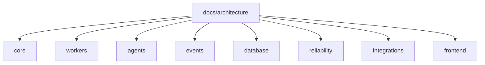

# Architecture Index

**Status**: Existing
**Last Updated**: 2026-09-08
**Stakeholders**: AI Engineer, Backend, Frontend, QA
**Related Docs**: [task.md](../../task.md), [AGENTS.md](../../AGENTS.md)

## Purpose

Единая точка входа в описание архитектуры Metacritic Games Intelligence.

## Key Principles

- Навигация через `index.md` в каждой папке.
- Документ ≤ 700 строк.
- Расхождение кода и этих документов — дефект в том же изменении.

## Components & Interactions

| Domain | Description | Location |
|--------|-------------|----------|
| Core | Обзор, конфигурация всего изменяемого | [core/index.md](core/index.md) |
| Workers | Демоны Kafka; реплики; similarity backfill | [workers/index.md](workers/index.md) |
| Agents | Только LLM/STT | [agents/index.md](agents/index.md) |
| Events | CloudEvents, топики, idempotency key | [events/index.md](events/index.md) |
| Database | Модель, unique, outbox | [database/index.md](database/index.md) |
| Reliability | Ошибки и recovery | [reliability/index.md](reliability/index.md) |
| Integrations | Адаптеры и устойчивость скрейпинга | [integrations/index.md](integrations/index.md) |
| Frontend | UI и монитор реплик | [frontend/index.md](frontend/index.md) |

Главный обзор: [core/system-architecture.md](core/system-architecture.md).

Конфиг: [core/configuration.md](core/configuration.md).

Реплики: [workers/replicas-and-idempotency.md](workers/replicas-and-idempotency.md).

Ошибки: [reliability/error-handling.md](reliability/error-handling.md).

Адаптеры: [integrations/adapters.md](integrations/adapters.md). Скрейпинг: [integrations/scraping-resilience.md](integrations/scraping-resilience.md).

Похожие игры: [workers/similarity.md](workers/similarity.md).

## Diagrams / Visuals

## Trade-offs & Justifications

Несколько файлов по доменам — из-за лимита 700 строк.

## Technical Details

- **Technology Stack**: Markdown + Mermaid.
- **Configuration & Env Vars**: не применимо к документации.
- **Dependencies & Versions**: Existing / 2026-09-08.
- **Testing Strategy**: структура, индексы, размер.
- **Deployment Considerations**: git рядом с кодом.

## Quality Attributes

Discoverability, навигация через `index.md`.
