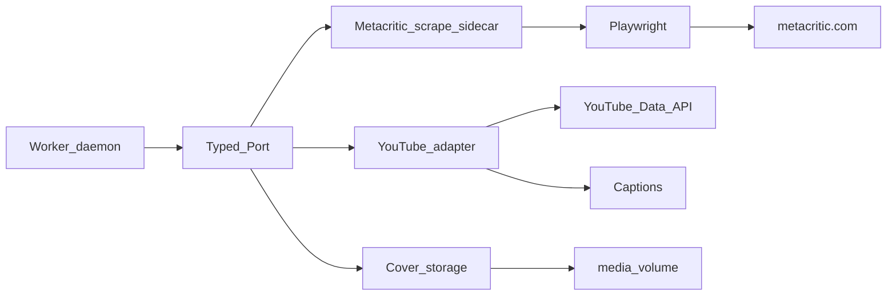

# Integration Adapters

**Status**: Existing
**Last Updated**: 2026-09-09
**Stakeholders**: AI Engineer, Backend
**Related Docs**: [scraping-resilience.md](scraping-resilience.md), [../workers/worker-catalog.md](../workers/worker-catalog.md), [../workers/similarity.md](../workers/similarity.md), [../agents/agent-catalog.md](../agents/agent-catalog.md), [../core/configuration.md](../core/configuration.md), [../events/event-contracts.md](../events/event-contracts.md)

## Purpose

Единственная граница к Metacritic, YouTube, файлам обложек и STT-провайдерам. Воркеры вызывают **типизированный Port** (Pydantic in/out из `packages/contracts`). Агенты порты не вызывают: им DTO отдаёт демон.

## Key Principles

1. Port в `packages/adapters/*`: интерфейс + DTO. Реализации подменяемы в тестах.
2. Воркеры не знают URL, селекторы, YouTube REST, путь к модели STT.
3. Скрейпинг не идёт через LangGraph. Агенты не ходят на внешние сайты.
4. Metacritic с браузером — **один** HTTP-sidecar: общий rate limit, пул Chromium, кеш страниц, circuit breaker.
5. YouTube и STT — in-process библиотеки (без браузера).
6. Таймаут на каждый внешний вызов. Недоверенный текст — data, уже урезанный `max_chars`.

## Components & Interactions



### Runtime

| Port | Runtime | Назначение |
|------|---------|------------|
| Metacritic | `apps/scrape/metacritic` HTTP JSON, те же DTO | Playwright, центральный rate limit, кеш, circuit |
| YouTube | `packages/adapters/youtube` in-process | Data API и субтитры, без браузера |
| Cover storage | `packages/adapters/media` | Volume обложек, отдаёт Query API |
| STT | `packages/adapters/stt` внутри TranscriptionAgent | OpenAI Whisper API |
| Embeddings | `packages/adapters/embeddings` HTTP | OpenRouter `POST /v1/embeddings` |

`adapters.metacritic.mode=in_process` — только тесты. Реплики Catalog ходят в один sidecar и не поднимают свой Chromium.

### Component: MetacriticPort

**Responsibility**: Listing, карточка, отзывы, скачивание обложки. Устойчивость разбора — [scraping-resilience.md](scraping-resilience.md).

**Interfaces** (транспорт — HTTP sidecar или in-process):

**`list_new_releases`** — `ListNewReleasesInput { limit }` → `GameListing`. Источник: New Releases на `/game/`.

**`list_browse_page`** — `ListBrowsePageInput { page, limit }` → `GameListing`. Browse newest; номер страницы задаёт воркер.

**`get_game`** — `GetGameInput { slug }` → `GameDetails`:

- `slug`, `title`, `cover_source_url`, `cover_bytes` (если скачалось), `developer`, `publisher`, `description`, `video_url`
- `platforms`: `PlatformScore[]` — metascore с карточки платформы; userscore Odyssey берётся из блока User score выбранной платформы (не из устаревшего `.c-siteReviewScore_user`).
- `developer` / `publisher`: Odyssey `hero-summary-developer` (текст «Developer: …» без обязательной ссылки) и json-ld.
- `genres`: `str[]` (нормализованные коды/ярлыки с карточки)
- `release_date`: `date | null`

**`get_critic_reviews` / `get_user_reviews`** — `{ slug, limit, max_chars }` → `ReviewBatch { items: ReviewSnippet[], truncated }`. HTML не отдаётся.

**`canary_parse`** — `{ slug }` → `{ ok, error_code }`. Известная карточка; не двигает курсор суток.

URL строятся внутри адаптера из `adapters.metacritic.base_url`.

### Component: YouTubePort

**Responsibility**: Найти релевантный летсплей, субтитры; при включённом STT — аудиоклип ограниченной длины.

**`search_letsplays`** — `{ title, max_results }` → `LetsPlaySearch { items: VideoHit[] }`.

`VideoHit`: `video_id`, `title`, `view_count`, `duration_seconds`, `channel_title`, `url`.

Отбор внутри адаптера:

1. Query из `search_query_template`.
2. Отсев: duration вне `[min_duration_seconds, max_duration_seconds]`; title не содержит нормализованный тайтл игры или его основную часть до двоеточия (без суффиксов edition/complete); маркеры compilation/top-10 в title.
3. Оставшиеся сортируются по `view_count` desc.
4. Воркер берёт `items[0]`. Пустой список — валидный `no_video`.

YouTube HTTP 429 и исчерпание квоты — `quota_exceeded` (деградация без повторных запросов, которые сжигают дневной лимит). Metacritic 429 остаётся Transient.

**`get_transcript`** — `{ video_id, max_chars }` → `{ status: ok \| transcript_unavailable, language, text, truncated }`. Нет субтитров — `transcript_unavailable`, не исключение.

**`get_audio`** — `{ video_id, max_duration_seconds }` → `{ status: ok \| unavailable, audio_ref | null }`. Только если STT включён и субтитров нет. Адаптер не выполняет STT.

### Component: SttPort

**Responsibility**: `audio_ref` → `{ text, language }`. Вызывается из TranscriptionAgent, не из YouTube-адаптера.

Реализация: OpenAI Whisper API (`stt.model=whisper-1`). Таймаут `stt.timeout_seconds`. `enabled=false` — порт не вызывается воркером.

### Component: CoverStorage

**Responsibility**: Хранить обложки локально. CatalogWorker после `get_game` пишет байты; API отдаёт файл.

- Ключ: `metacritic_slug`.
- `games.cover_url` в проекции UI = `/api/v1/media/covers/{slug}`.
- `games.cover_source_url` — исходный URL для provenance.
- Сбой скачивания: `cover_url=null`, warning, карточка живая.

### Ошибка адаптера

```text
AdapterError { code: not_found|timeout|rate_limited|parse_error|quota_exceeded|unavailable|circuit_open, message }
```

Маппинг на воркер: timeout / rate_limited / unavailable / circuit_open → Transient; not_found → NotFound; parse_error → ParseError; quota_exceeded → QuotaError. Для YouTube HTTP 429 кодируется как `quota_exceeded`, не Transient: повтор сжигает дневную квоту Search API.

### Связь с воркерами

| Worker | Port methods |
|--------|----------------|
| DiscoveryWorker | `canary_parse` (если включён), `list_new_releases`, `list_browse_page` |
| CatalogWorker | `get_game` + CoverStorage |
| ReviewsWorker | `get_critic_reviews`, `get_user_reviews` |
| LetsPlayWorker | `search_letsplays`, `get_transcript`, опционально `get_audio` |
| TranscriptionAgent | SttPort |
| Scheduler, Similarity | нет портов к сайтам (similarity — embedding adapter) |

## Diagrams / Visuals

См. flowchart выше. Resilience-поток — [scraping-resilience.md](scraping-resilience.md).

## Trade-offs & Justifications

- HTTP sidecar для Metacritic: изоляция Playwright и единый rate limit на все реплики воркеров.
- YouTube in-process: нет браузера, отдельный контейнер не нужен.
- Обложки на volume: UI не зависит от TTL внешнего CDN.
- Адаптеры — внешний I/O. Шина между воркерами — Kafka.

## Technical Details

- **Technology Stack**: httpx + Pydantic; Playwright в sidecar; YouTube Data API v3; youtube-transcript/timedtext; OpenAI Whisper API в SttPort; эмбеддинги — OpenRouter `POST /v1/embeddings`.
- **Configuration & Env Vars**: [configuration.md](../core/configuration.md) — `adapters.*`, `media.*`, `stt.*`, `embeddings.*`.
- **Dependencies & Versions**: lock uv; Chromium в image sidecar.
- **Testing Strategy**: порты на HTML/JSON фикстурах без сети; fake sidecar; контракт JSON Schema I/O.
- **Deployment Considerations**: sidecar только в docker network, не публиковать. Resource limits на Chromium. Volume `media/covers`.

## Quality Attributes

Isolation HTML, security (ключ YouTube только в youtube-адаптере), rate-limit safety, testability.
