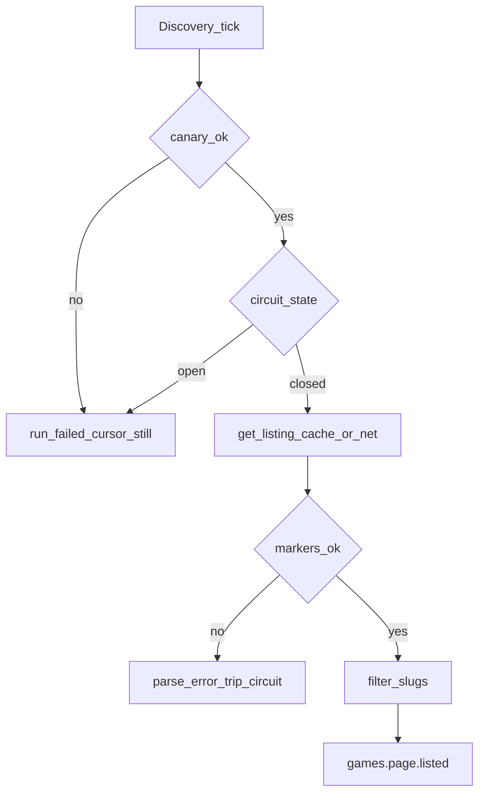

# Scraping Resilience

**Status**: Existing
**Last Updated**: 2026-09-09
**Stakeholders**: AI Engineer, Backend, QA
**Related Docs**: [adapters.md](adapters.md), [../reliability/error-handling.md](../reliability/error-handling.md), [../reliability/recovery.md](../recovery.md), [../frontend/web-ui.md](../frontend/web-ui.md), [../core/configuration.md](../core/configuration.md)

## Purpose

Скрейпинг Metacritic — главный операционный риск пайплайна. Документ задаёт fail-closed разбор, кеш, circuit breaker, вежливость к сайту, canary, локальные обложки и поля монитора. Разбор HTML выполняют адаптер и sidecar; воркеры получают уже типизированный результат.

## Key Principles

1. Пустой listing при отсутствии обязательных DOM-маркеров — `parse_error`, не «страница без игр».
2. На каждый этап — один актуальный парсер и один набор golden HTML. Смена вёрстки = обновить селекторы и эти фикстуры.
3. Повторы не долбят сайт: свежий page cache, единый rate limit в sidecar, `attempt_count` в БД.
4. `parse_error` и `circuit_open` — P0 для монитора/алерта, не `degraded`.
5. UI не зависит от чужого CDN: обложки сохраняются локально.

## Components & Interactions

### Fail-closed listing и карточка

Каждая страница имеет **маркеры** в конфиге (`adapters.metacritic.markers.*`): контейнер блока, минимальное число карточек на непустой выдаче, заголовок секции.

| Наблюдение | Код | Курсор суток |
|------------|-----|--------------|
| Маркеры на месте, 0 игр | успех, пустая страница | page+1 |
| Маркер отсутствует / селектор 0 при ожидаемой выдаче | `parse_error` | **не двигать** |
| Часть карточек без slug | отбросить битые; 0 валидных при ненулевых карточках — `parse_error`; если карточек ≥ `listing_min_cards` (>1) и валидных игр меньше порога — `parse_error` | `parse_error` |
| HTTP 403/challenge / timeout | Transient / `unavailable` | не двигать |
| Карточка 404 | `not_found` | не относится |

Discovery **не** публикует `games.page.listed` из частично распознанного мусора.

Playwright ждёт маркеры после `DOMContentLoaded`. На страницах `/critic-reviews/` и `/user-reviews/` sidecar принимает cookie banner, ждёт контейнер, затем карточки: критики до `CRITIC_REVIEWS_CARD_WAIT_MS`, пользователи до `REVIEWS_CARD_WAIT_MS` (пустая user-страница не должна держать пул 15+ секунд). Reviews ходит в sidecar **последовательно**: таймаут user не отбрасывает уже скачанных критиков. HTTP-клиент sidecar читает дольше, чем `timeout_seconds` навигации Playwright.

### Golden fixtures

- Фикстуры: `tests/fixtures/metacritic/` — listing New Releases, browse page, card, reviews.
- Один набор HTML покрывает текущий DOM: BEM-разметка и живой Odyssey (`data-testid`, JSON-LD `VideoGame`). Unit парсера **без сети**. CI падает, если фикстура не разбирается текущими селекторами.
- Canary (сеть) — не в unit; периодический или перед listing.

Смена вёрстки: обновить фикстуру и селекторы. Устаревший HTML вытесняется TTL кеша.

### Page cache

Таблица `external_page_cache`:

| Column | Notes |
|--------|--------|
| `url_hash` | PK |
| `fetched_at` | timestamptz |
| `body` | bytea/text, без секретов |
| `content_type` | |
| `http_status` | |

TTL: `adapters.metacritic.cache_ttl_seconds` (default 3600). Transient retry **читает кеш**, если запись свежая: не умножает запросы при 5xx после уже скачанного HTML. Неудачный разбор кеш не помечает как валидный listing.

Инвалидация: истечение TTL или ручной `POST` оператора (вне MVP UI — CLI).

### Circuit breaker

Состояние в sidecar (и зеркало в `adapter_health` для API):

| Поле | Смысл |
|------|--------|
| `state` | `closed \| open \| half_open` |
| `parse_error_streak` | подряд |
| `opened_at` | |

Пороги: `circuit_fail_threshold` (default 3 parse_error подряд или доля в окне), `circuit_open_seconds` (default 600).

Пока `open`: методы listing/get возвращают `circuit_open` → воркер Transient, **курсор стоит**, run failed если listing не получен. Heartbeat sidecar / монитор: `circuit_open`. Не алертить каждый `degraded` летсплея; алертить circuit и listing failed.

Half-open: один canary или один listing; успех закрывает, parse_error открывает снова.

### Canary

`adapters.metacritic.canary_slug` — стабильная публичная карточка.

Discovery перед listing, если `canary_enabled=true`: `canary_parse`. Неуспех → не звать listing, run `failed`, курсор не двигать. Canary не пишет `daily_processed_slugs`. Sidecar listing (`list_new_releases` / `list_browse_page`) **не** повторяет canary: canary — ответственность Discovery, иначе двойной fetch и ложный trip circuit.

Период: каждый tick достаточно (1/час). Не отдельный Kafka-воркер.

### Вежливость и антишторм

Всё в sidecar, не в каждой реплике воркера:

- `min_delay_ms` между навигациями, jitter из `retry.jitter_ratio`
- Один browser pool (`pool_size` default 1–2)
- Общий очередь запросов реплик Catalog/Reviews/Discovery
- `user_agent` и locale из конфига, headless из конфига
- Не параллелить десятки вкладок «чтобы успеть 20 игр»

Цель — не обход защиты любой ценой, а предсказуемый отказ (Transient / circuit) вместо бана и пустой БД.

### Обложки

См. CoverStorage в [adapters.md](adapters.md). Скачивание в sidecar при `get_game` только с host = origin `adapters.metacritic.base_url` или `*.metacritic.com` (без userinfo). Иначе `cover_bytes=null`, warning. Битые байты не пишем: `cover_url=null`.

Query API: `GET /api/v1/media/covers/{slug}` — file from volume; `Cache-Control` свой. Не проксировать произвольный URL (нет SSRF).

### Монитор и оператор

Снимок `/monitor` включает:

- `scrape.circuit_state`, `scrape.last_parse_error_at`
- counts `parse_error` за сутки (из `ingestion_items.error_type`)

Кнопка **Run now** шлёт тот же `schedule_tick`, что и cron: New Releases (20), затем browse `N+1`. Второй tick, пока предыдущий listing ещё идёт, открывает **следующую** страницу, а не дубль текущей. Если listing failed — курсор стоит, Run now повторяет ту же страницу.

P0: рост `parse_error`, `circuit_open`, `ingestion_runs.status=failed` на listing. Не P0: пустые отзывы, нет летсплея.

## Diagrams / Visuals

## Trade-offs & Justifications

- Fail-closed важнее полноты: лучше пропустить час, чем 20 мусорных slug в Kafka.
- Кеш + один sidecar важнее «реплики с собственным Playwright»: иначе rate limit фиктивный.
- Canary на известном slug ловит смену вёрстки до browse page 7.

## Technical Details

- **Technology Stack**: Playwright sidecar, PostgreSQL cache table, файловый volume обложек.
- **Configuration & Env Vars**: `adapters.metacritic.*`, `media.*` — [configuration.md](../core/configuration.md).
- **Dependencies & Versions**: фикстуры в git согласованы с селекторами в конфиге.
- **Testing Strategy**: маркеры на golden HTML; пустой DOM → parse_error; кеш hit без сети; circuit открывается после N ошибок на fake sidecar. Без живого Metacritic в unit.
- **Deployment Considerations**: лимиты CPU/RAM sidecar; volume cache опционален (БД достаточно на демо).

## Quality Attributes

Operability (P0 на разбор), courtesy, recoverability курсора, integrity listing, независимость UI от CDN.
