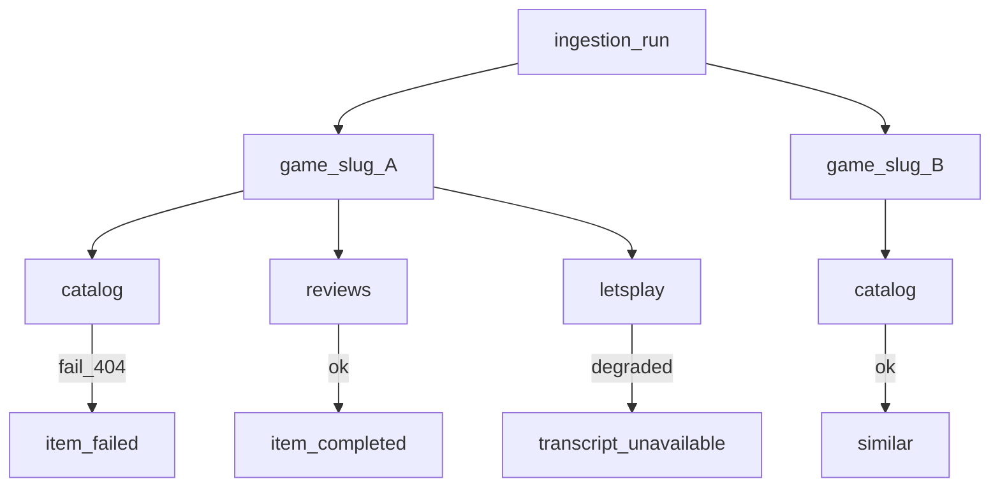
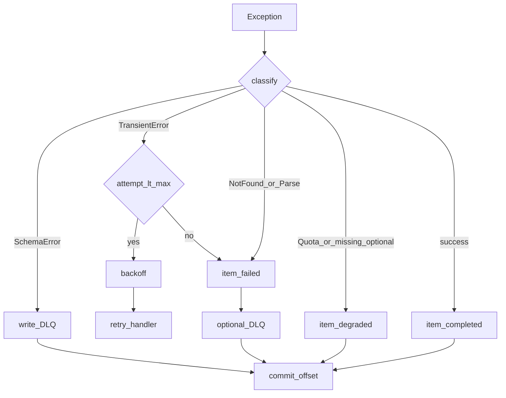

# Error Handling

**Status**: Existing
**Last Updated**: 2026-09-09
**Stakeholders**: AI Engineer, Backend, QA
**Related Docs**: [recovery.md](recovery.md), [../workers/worker-catalog.md](../workers/worker-catalog.md), [../workers/replicas-and-idempotency.md](../workers/replicas-and-idempotency.md), [../core/configuration.md](../core/configuration.md), [../agents/agent-catalog.md](../agents/agent-catalog.md), [../events/event-contracts.md](../events/event-contracts.md), [../database/data-model.md](../database/data-model.md)

## Purpose

Явная политика ошибок пайплайна: какие сбои бывают, что ретраится, что деградирует, что уходит в DLQ, как фиксируется этап в БД и что видит UI. Восстановление после рестарта процесса — в [recovery.md](recovery.md); здесь — классификация и поведение **во время обработки**.

## Key Principles

1. Сбой одной игры или одной стадии не останавливает остальные игры и другие стадии той же игры (хореография).
2. Ретраи только для **транзиентных** сбоев. Бизнес-ошибки и яд схемы не крутятся в цикле.
3. Необязательные данные → warning + деградация поля, не падение воркера.
4. Типизированные исключения в `packages/` (`TransientError`, `NotFoundError`, `ParseError`, `SchemaError`, `QuotaError`). Запрещены `except Exception: pass` и глотание ошибок.
5. В логи и `error_message` не попадают секреты, токены, сырой HTML, полные транскрипты, персональные данные.
6. Агент не ставит политику retry для адаптеров сайтов: это делает демон (и sidecar). Агент ретраит только вызов модели/STT.
7. Повтор от реплики или rebalance — не ошибка: unique `idempotency_key` → no-op и commit offset.

## Components & Interactions

### Иерархия ошибок

| Тип | Когда | Retry | Commit offset | Item status | DLQ |
|-----|--------|-------|---------------|-------------|-----|
| `SchemaError` | битый CloudEvent / `data` | нет | да, после записи DLQ | не создаём / не меняем домен | да, `reason=schema` |
| `TransientError` | timeout, 429, 5xx адаптера/LLM/Kafka/DB, `circuit_open` | да, backoff | нет, пока не исчерпан лимит | `running`, затем `failed` | после лимита, `reason=timeout`/`handler` |
| `NotFoundError` | игра 404 | нет | да | `failed` | нет (ожидаемый бизнес-исход) |
| `ParseError` | адаптер не разобрал страницу / нет DOM-маркеров | нет бесконечного | да после финального fail | `failed` | да, `reason=handler`; **P0** |
| `QuotaError` | YouTube quota | нет до следующего окна | да | `degraded` (`quota_exceeded`) | нет |
| `ValidationError` (LLM schema) | модель не попала в Pydantic | да, до `retry.llm_structure_retries` | нет пока ретраи | затем `failed` или `degraded` | после лимита |
| Успех с пробелами | нет видео, нет отзывов, нет captions | не ошибка | да | `completed` или `degraded` | нет |

`Degraded` — валидный терминальный исход стадии: карточка в UI живая, блок пустой/с пояснением.

### Политика retry (демоны)

Настройки retry — `retry.*` в [configuration.md](../core/configuration.md), не магические числа в коде:

| Параметр | Default | Смысл |
|----------|---------|--------|
| `retry.max_attempts` | 5 | попытки на одно событие для Transient |
| `retry.backoff_base_seconds` | 1 | экспонента `base * 2^(n-1)` |
| `retry.backoff_max_seconds` | 60 | потолок + jitter |
| `retry.jitter_ratio` | 0.2 | |
| `app.http_timeout_seconds` | 30 | каждый адаптер/HTTP |
| `llm.timeout_seconds` | 60 | вызов модели |
| `retry.llm_structure_retries` | 2 | доп. попытки structured output |
| `kafka.max_poll_interval_ms` | > худшего handler | consumer не выкидывают из group |

Ретраи **внутри** обработки сообщения, offset не коммитится. После лимита: item `failed`, опционально DLQ, **затем** commit — партиция не клинит.

Не ретраить: 404, schema, parse_error стабильный, quota, пустые отзывы.

### Политика retry (агенты)

Агент получает уже извлечённые данные. Ретраит только:

- 5xx / timeout провайдера LLM;
- невалидный structured output (повтор invoke с тем же входом).

Не ретраит «нет смысла в тексте»: это решает воркер до вызова (пустые отзывы → агент не звать).

LangGraph `RetryPolicy` — только на node вызова модели. Checkpoint (PostgresSaver) — только агентный subgraph, чтобы не потерять дорогой успешный LLM при падении процесса сразу после него. См. [recovery.md](recovery.md).

### Матрица по стадиям

| Стадия | Типичный сбой | Поведение | Курсор суток | Соседи |
|--------|---------------|-----------|--------------|--------|
| Scheduler | дубль той же страницы | unique + следующая страница | не трогает | нет второго listing той же page |
| Scheduler | БД down | не ready, tick копится в Kafka/outbox API | — | — |
| Discovery listing timeout/5xx/`circuit_open` | Transient | retry; курсор **не** двигается | повтор часа = та же страница | Catalog не получает лишних slug |
| Discovery `parse_error` / canary fail | ParseError | fail-closed; курсор **не** двигается; P0 | не page+1 | нет мусорных slug |
| Discovery пустая страница (маркеры на месте) | успех | run completed | page+1 | нет событий игр |
| Discovery все slug уже сегодня | успех | run completed | page+1 | нет дублей |
| Discovery crash до persist | — | offset не commit | не двигается | повтор listing безопасен |
| Catalog 404 | NotFound | item failed | не относится | Reviews/LetsPlay могут всё же отработать по discovered |
| Catalog нет видео/обложки/developer | degrade поля | completed + warning | — | Similarity всё равно получит cataloged |
| Reviews timeout адаптера | Transient | retry | — | карточка без резюме, пока не успех/fail |
| Reviews пустые отзывы | degrade | completed, `degraded=true`, агент skip | — | Similarity без summaries |
| Reviews LLM fail после лимита | failed stage | остальные стадии игры живут | — | |
| LetsPlay нет роликов | degrade | `no_video` | — | |
| LetsPlay нет субтитров, STT выкл | degrade | `transcript_unavailable` | — | |
| LetsPlay quota | degrade | `quota_exceeded` | — | |
| LetsPlay STT (Whisper API) fail | retry затем degrade | карточка без заключения | — | |
| LetsPlay LLM analyst fail после лимита | failed stage | карточка без заключения | — | |
| Similarity нет соседей | успех | пустой список | — | |
| Similarity embedding 5xx | Transient | retry | — | |
| Similarity full recompute | — | идемпотентен на час | не трогает listing | переписывает similar_games |
| Яд схемы любого топика | Schema | DLQ + commit | не двигается зря | партиция жива |
| Outbox produce fail | Transient relay | строка unpublished | домен уже записан | сосед проснётся, когда relay догонит |

### Изоляция

`ingestion_runs.status=failed` только если **не удалось listing** (Discovery не получил страницу). Провалы отдельных игр run не валят.

### Запись ошибки

`ingestion_items`: `status`, `error_type` (имя класса), `error_message` (коротко, без payload), `updated_at`.

Лог JSON: `run_id`, `slug`, `worker`, `stage`, `event_id`, `error_type`, `attempt`.

Heartbeat: при непрерывных ошибках `status=error`, `current_subject=slug`.

UI монитор показывает failed/degraded counts, `circuit_state` sidecar и parse_error за сутки; карточка игры показывает частичные блоки, не 500.

### Адаптер → воркер

Адаптер возвращает структурированный `AdapterError { code, message }`. Воркер мапит:

| `code` | Тип воркера |
|--------|-------------|
| `timeout`, `rate_limited`, `unavailable`, `circuit_open` | `TransientError` |
| `not_found` | `NotFoundError` |
| `parse_error` | `ParseError` |
| `quota_exceeded` | `QuotaError` |

### Что не делаем

- Не ретраим весь run из-за одной игры.
- Не вызываем соседнего воркера «попробуй ещё раз».
- Не парсим текст LLM регулярками, если schema не сошлась — только повтор structured invoke.
- Не пишем stack trace с env/secrets в БД.
- Не двигаем browse-курсор, пока Discovery не обработал listing успешно (включая canary и маркеры).
- Не считаем 0 игр успехом, если DOM-маркеры listing отсутствуют.

## Diagrams / Visuals

## Trade-offs & Justifications

- DLQ на schema сразу (commit) важнее «не потерять байты»: яд иначе блокирует партицию навсегда.
- Catalog 404 не ретраится: повтор не создаст страницу.
- LetsPlay quota — degrade, не failed: это ограничение API, не дефект игры; UI честно говорит «квота».
- Listing без DOM-маркеров — parse_error, не пустой успех: лучше пропустить час, чем отравить шину.
- Отдельный документ от recovery: политика «что считать ошибкой» и «как подняться после kill -9» — разные вопросы; оба обязательны.

## Technical Details

- **Technology Stack**: свои исключения; tenacity или эквивалент только в daemon retry helper; LangGraph RetryPolicy только в агентах.
- **Configuration & Env Vars**: таблица retry выше; `HEARTBEAT_STALE_SECONDS` для UI.
- **Dependencies & Versions**: без отдельного saga-фреймворка.
- **Testing Strategy**: матрица «вход ошибки → status/DLQ/курсор/offset» на fake Port; LLM schema fail затем успех; 404 catalog; listing 500 × N затем fail item/run; parse_error не двигает курсор; poison message не блокирует следующее валидное. Без сети.
- **Deployment Considerations**: алерты: рост DLQ, `run failed` на listing, `parse_error` / `circuit_open`, stale heartbeats. Не алертить каждый `degraded`.

## Quality Attributes

Predictable failure, partition safety, partial availability UI, operability, no retry storms on business errors.
