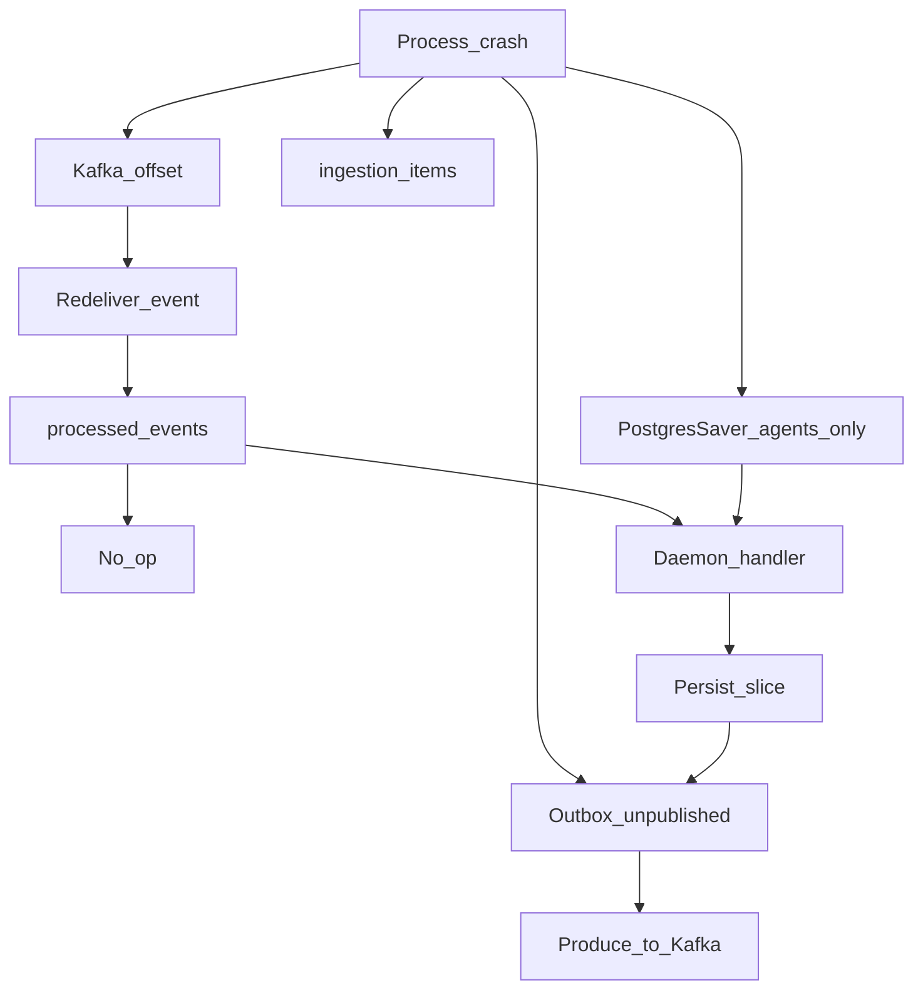

# Recovery and Fault Tolerance

**Status**: Existing
**Last Updated**: 2026-09-09
**Stakeholders**: AI Engineer, Backend, QA
**Related Docs**: [error-handling.md](error-handling.md), [../database/data-model.md](../database/data-model.md), [../workers/worker-catalog.md](../workers/worker-catalog.md), [../workers/replicas-and-idempotency.md](../workers/replicas-and-idempotency.md), [../core/configuration.md](../core/configuration.md)

## Purpose

Как система **поднимается после сбоя процесса** и продолжает с последнего устойчивого этапа. Классификация ошибок, retry и DLQ во время обработки — в [error-handling.md](error-handling.md); этот документ не дублирует матрицу стадий, а описывает якоря состояния.

## Key Principles

- Семантика: **at-least-once** + идемпотентный handler. Kafka EOS не требуется.
- Якоря **каждого демона**: Kafka offset, строки `ingestion_items` / `daily_processed_slugs` / доменный срез, unpublished `outbox`.
- Дополнительный якорь **только у агентов**: LangGraph `PostgresSaver` (дорогой LLM/STT).
- Offset коммитится после COMMIT БД (persist + outbox + `processed_events`).
- Демон после рестарта не вызывает соседей: либо доигрывает своё сообщение, либо сосед сам ещё не получил событие из outbox.

## Components & Interactions

### 1. Рестарт демона (без агента)

Типично: Scheduler, Discovery, Catalog, Similarity.

1. Процесс стартует, consumer group продолжает с committed offset.
2. Незакоммиченное сообщение приходит снова.
3. Есть `processed_events(worker_type, event_id)` → ack, работы нет **у этого** типа воркера. Другой тип на том же CloudEvent `id` всё равно обработает.
4. Persist был, offset нет → unique/idempotent upsert, повторный outbox insert не создаёт новый CloudEvents `id`.
5. Persist не было → handler с нуля (GET адаптера идемпотентен; listing может прийти из page cache).

Checkpoint LangGraph здесь **не используется**.

### 2. Рестарт демона с агентом (Reviews, LetsPlay)

То же плюс:

- Если адаптер уже отработал, а LLM нет — повтор handler снова вызовет Port (дешёвый относительно LLM, при свежем cache — без сайта) и агента.
- Если LLM успел, процесс умер до persist — PostgresSaver по `thread_id` отдаёт готовый structured output, воркер не платит за токены повторно.
- Если persist прошёл — `processed_events` короткое замыкание, агент не зовётся.

`thread_id` = `{run_id}:{slug}:{agent_name}`.

### 3. Outbox relay

В процессе того же воркера (`producer` = имя воркера):

- Claim (`SKIP LOCKED`) коммитится до Kafka send: лок не держится на время сети.
- Produce fail → `published_at` остаётся NULL, цикл повторит.
- Send успешен, `mark_published` не успел → повторный produce с тем же CloudEvents `id` (at-least-once).
- Relay не классифицирует бизнес-ошибки.

После рестарта unpublished строки догоняются без Kafka-rewind.

### 4. Курсор суток (Discovery)

Двигается **только** после успешной обработки listing (включая «пусто» и «все уже сегодня»). Listing fail / crash до успеха — курсор стоит; следующий tick или redelivery берёт ту же страницу. Подробная таблица сценариев — в [error-handling.md](error-handling.md).

### 5. Продолжение «с последнего этапа»

Этап — не общий оркестратор, а **факт в БД + непрочитанные топики**:

| Что уже есть | Что произойдёт после рестарта |
|--------------|-------------------------------|
| slug в `daily_processed_slugs`, `games.page.listed` в Kafka/outbox | Catalog догонит страницу; Reviews/LetsPlay — по `game.cataloged` |
| catalog срез записан, outbox unpublished | relay эмитит `game.cataloged` → Similarity |
| reviews failed, catalog ok | UI с карточкой без резюме; повтор только если replay события reviews |
| воркер убит в retry Transient | тот же offset, retry с нуля попыток **или** счётчик попыток в item (предпочтение: поле `attempt_count` на item, чтобы не крутить бесконечно после многих рестартов) |

`ingestion_items.attempt_count`: увеличивается на каждую Transient-попытку, переживает рестарт процесса; лимит `retry.max_attempts`.

### 6. Инфраструктура

| Сбой | Поведение |
|------|-----------|
| Postgres down | readiness fail (воркер ретраит старт, затем падает); Kafka копит; API 503 |
| Kafka down | домен+outbox пишутся; relay ждёт; consume не стартует, пока брокер не готов |
| Scrape sidecar / Metacritic down / circuit_open | Transient в Discovery/Catalog/Reviews; курсор listing стоит |
| LLM / STT down | только Reviews/LetsPlay стадии; карточки продолжают наполняться catalog |

### 7. Runbook

1. Restart контейнера воркера → offset + outbox + attempt_count.
2. Яд в `ingestion.dlq` — фикс схемы, ручной replay.
3. Listing failed / parse_error / circuit_open — не крутить browse вперёд руками; починить sidecar/селекторы/фикстуры, дождаться half-open или нажать **Run now** (курсор на той же странице).
4. Зависший stage одной игры — replay CloudEvent этой стадии (CLI/операция вне MVP UI); unique не даст дубликат среза.
5. Смена суток: старый `process_date` в полёте доигрывается; новые tick — новый день.

UI кнопка запуска **не** допинывает stuck item, а создаёт новый tick (новый run). Это намеренно: ручной запуск = «ещё 20 игр / та же политика дня», не «retry slug X».

## Diagrams / Visuals

## Trade-offs & Justifications

- Checkpoint не ставим на Catalog: лишние таблицы и сложность ради дешёвого GET.
- `attempt_count` в БД, не только in-memory: рестарт каждые N секунд иначе обнуляет backoff и долбит sidecar/Metacritic.
- Кнопка UI ≠ retry item: проще семантика, меньше риска шторма.

## Technical Details

- **Technology Stack**: Kafka manual commit, outbox poll, AsyncPostgresSaver только packages/agents, `attempt_count` на items.
- **Configuration & Env Vars**: [configuration.md](../core/configuration.md) — `retry.*`, таймауты, DLQ event name.
- **Dependencies & Versions**: `langgraph-checkpoint-postgres` не в образах Scheduler/Discovery/Catalog/Similarity.
- **Testing Strategy**: kill после persist до offset; kill во время LLM (resume checkpoint); kill во время Catalog GET (повтор, возможен cache hit); unpublished outbox после restart; attempt_count не сбрасывается. Fake Port/LLM.
- **Deployment Considerations**: `max.poll.records` умеренный.

## Quality Attributes

Recoverability демонов, экономия токенов на resume агента, безопасность курсора, operability без оркестратора.
