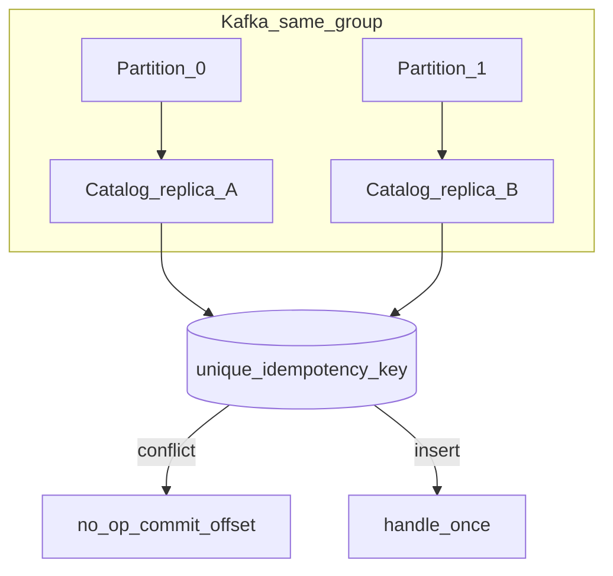

# Replicas and Idempotency

**Status**: Existing
**Last Updated**: 2026-09-09
**Stakeholders**: AI Engineer, Backend, Ops
**Related Docs**: [worker-catalog.md](worker-catalog.md), [../core/configuration.md](../core/configuration.md), [../events/event-contracts.md](../events/event-contracts.md), [../database/data-model.md](../database/data-model.md)

## Purpose

Как горизонтально масштабировать воркер (две одинаковые реплики Catalog, Reviews, …) без двойной обработки и дублей в БД/Kafka. Гарантий Kafka **недостаточно**; обязательны consumer group из конфига, ключ партиции, детерминированный idempotency key и unique в PostgreSQL.

## Key Principles

1. Реплики одного типа — **одна** consumer group (`kafka.consumer_groups.*`). Разные group = каждая реплика получит **все** сообщения.
2. Kafka: at-least-once. При ребалансе, рестарте до commit offset, retry продюсера одно и то же бизнес-действие может прийти дважды — даже в одной group.
3. Идемпотентность — в БД, не «надежда на брокер».
4. Два ключа: CloudEvents `id` (уникальность записи шины) и `idempotency_key` (уникальность **операции**: тип + run + игра + стадия).
5. Scheduler с in-process cron на каждой реплике сам генерирует дубли тиков; это закрывается lock + unique, либо внешним одиночным cron.

## Components & Interactions

### Что даёт Kafka

| Механизм | Эффект при 2 репликах с **одной** group | Чего не даёт |
|----------|------------------------------------------|--------------|
| Consumer group | Партиция закреплена за одним членом; обычное сообщение обрабатывает одна реплика | Ровно один раз: rebalance / uncommitted offset |
| Message key = `subject` (slug) или `run_id` | События одной игры в одной партиции, без гонки двух реплик на одном slug **пока нет rebalance** | Защиту после падения mid-handler |
| Доставка | at-least-once при ручном commit после БД | exactly-once для adapter/LLM side effects |

Вывод: group + key нужны для масштабирования и порядка. От дублей спасает **идемпотентный handler**.

### Idempotency key

Расширение CloudEvents (обязательное): `idempotencykey`.

Считается **детерминированно** по шаблону из конфига (`idempotency.key_template`), не новым UUID на каждый retry outbox:

```text
{event_type}:{run_id}:{subject}:{stage}
```

Примеры:

- Catalog на slug `elden-ring`, run `R`: входящее `games.page.listed` ключ `{page_listed_type}:{R}:{R}:discovered`. Исходящее `game.cataloged` — `{cataloged_type}:{R}:{slug}:cataloged`.
- Reviews/LetsPlay читают ключ с `game.cataloged` и считают новый для своего исходящего события.

Входящая обработка Catalog:

- `idempotency_key` события `games.page.listed` = `{page_listed_type}:{run_id}:{run_id}:discovered`
- unique `processed_events.(worker_type, idempotency_key)` → вторая **реплика** Catalog / повтор делает no-op. Reviews и LetsPlay на том же событии — отдельные строки.

Исходящий emit:

- новый CloudEvents `id` (UUIDv7)
- `idempotency_key` = `{cataloged_type}:{run_id}:{slug}:cataloged`
- unique на `outbox.idempotency_key` — две реплики не вставят два исходящих события одной стадии

Если продюсер по ошибке шлёт тот же смысл с другим `id`, бизнес-ключ всё равно совпадёт.

### БД-замки

В одной транзакции persist:

1. Короткий SELECT: уже есть `processed_events` для этого `worker_type` + `event_id`/`idempotency_key` → commit offset, без I/O.
2. Внешний I/O (Metacritic/YouTube/LLM/эмбеддинги) **вне** транзакции — соединение из пула не держится на 30–60s HTTP.
3. `INSERT processed_events(...) ON CONFLICT DO NOTHING` + persist домена + outbox в одной транзакции.
4. Если conflict на insert (гонка реплик после шага 1) → commit пустой работы, commit Kafka offset.
5. Опционально `SELECT … FOR UPDATE` на `ingestion_items` по `(run_id, slug, stage)` с `lease_seconds`.

Неожиданное исключение handler (не Transient/Parse/NotFound/Quota/LLM) → item failed, DLQ `handler`, commit offset. Сбой heartbeat не валит процесс.

`ingestion_items` unique `(run_id, slug, stage)` — второй insert стадии падает в no-op.

`daily_processed_slugs` PK — второй Discovery той же игры в сутки no-op.

`processed_events` unique scoped by `worker_type`: Reviews, LetsPlay и Similarity на одном `game.cataloged` не вытесняют друг друга. Реплики одного типа — по-прежнему no-op.

Scheduler: `INSERT ingestion_runs` с unique in-flight `(process_date, source, page)` для cron **и** manual; следующий tick берёт следующую страницу (см. data-model); плюс `pg_try_advisory_lock(scheduler.advisory_lock_key)` на время открытия run.

### Tick / cron и две реплики Scheduler

| `scheduler.tick_source` | Поведение |
|-------------------------|-----------|
| `external` (канон) | Один cron-контейнер или k8s CronJob шлёт `schedule_tick`. N реплик Scheduler в одной group делят партиции. Unique run + lock на всякий случай. |
| `in_process` | Каждая реплика имеет таймер. Без lock обе эмитят tick. Обязательны advisory lock + `tick_dedup_window_seconds`. |

UI `POST /runs` пишет в outbox API один tick; не зависит от числа реплик Scheduler.

### Heartbeat при репликах

PK `worker_heartbeats`: `(worker_type, instance_id)`. UI показывает две строки Catalog. Stale по `instance_id`. `processed_ok` — счётчик процесса, не глобальный (глобальные counts — из `ingestion_items`).

### Outbox relay

Реплики одного типа шарят таблицу. Короткий `FOR UPDATE SKIP LOCKED` только на чтение unpublished-строк, затем COMMIT; Kafka produce **вне** лока; `published_at` в отдельной транзакции. Unique `idempotency_key` не даёт двум writer'ам вставить копию события. Повторный produce после kill между send и `published_at` допустим (at-least-once, consumers идемпотентны). `producer` = `worker_type` (не instance), чтобы любая реплика догнала чужой unpublished после kill.

### Сколько реплик имеет смысл

Нужно `kafka.partitions.game_events >=` число реплик Catalog/Reviews/LetsPlay/Similarity. Иначе лишние реплики idle.

Discovery и Scheduler: обычно 1; 2 безопасны при lock+unique, но мало партиций control — вторая чаще простой.

Metacritic sidecar: единый rate limit в конфиге; N воркеров Catalog/Reviews/Discovery стоят в очереди sidecar, иначе бан. Реплики **не** поднимают свой Chromium.

### Запрещено

- Задавать репликам разные `consumer_groups.*`.
- Генерировать `idempotency_key` как random UUID.
- Cron внутри каждой реплики без lock при `tick_source=in_process`.

## Diagrams / Visuals



Rebalance mid-flight: обе могут начать handler; unique решает победителя.

## Trade-offs & Justifications

At-least-once + идемпотентность проще и надёжнее Kafka EOS (который не покрывает HTTP адаптера/LLM). Ключ операции отдельно от `id`: повторная публикация с новым UUID не плодит стадии.

## Technical Details

- **Technology Stack**: Kafka consumer group, PostgreSQL unique + SKIP LOCKED + advisory lock.
- **Configuration & Env Vars**: [configuration.md](../core/configuration.md) — groups, partitions, template, tick_source, instance_id, lease.
- **Dependencies & Versions**: не нужен отдельный Redis lock; Postgres достаточно.
- **Testing Strategy**: два handler **одного** типа параллельно на одном событии — один persist, один no-op; Reviews+LetsPlay+Similarity на одном `game.cataloged` — три persist; повтор с новым `id` тем же business key — no-op; две Scheduler in_process — один run за окно; разные group в тесте показывают дубль (документированный anti-test).
- **Deployment Considerations**: Compose `deploy.replicas`; один и тот же env group; `HOSTNAME` как instance_id.

## Quality Attributes

Horizontal scalability, duplicate-safety, operability (видны обе реплики в мониторе).
