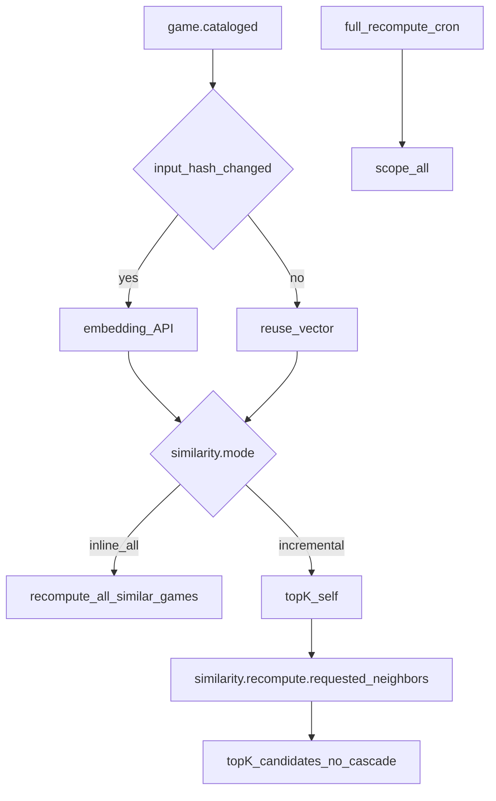

# Similarity

**Status**: Existing
**Last Updated**: 2026-09-09
**Stakeholders**: AI Engineer, Backend
**Related Docs**: [worker-catalog.md](worker-catalog.md), [../database/data-model.md](../database/data-model.md), [../events/event-contracts.md](../events/event-contracts.md), [../core/configuration.md](../core/configuration.md), [../integrations/adapters.md](../integrations/adapters.md)

## Purpose

Похожие игры **из своей БД** остаются актуальными при росте каталога: обновление игры пересчитывает её top-K и списки других игр, которые должны на неё ссылаться. SimilarityWorker — автономный демон на Kafka, не агент.

## Key Principles

1. Список похожих — проекция, которую можно полностью пересчитать. Источник правды: эмбеддинги + платформы + жанры + дата релиза в PostgreSQL.
2. Новая или обновлённая игра обновляет **свой** top-K и **чужие** списки, которые должны начать на неё ссылаться.
3. Эмбеддинг-API не вызывается, если `embedding_input_hash` не изменился. Пересчёт соседей при росте корпуса — всё равно.
4. Пока строк мало — sequential scan, не HNSW. Индекс включается порогом из конфига.
5. Self в `similar_games` запрещён схемой.

## Components & Interactions

### Вход эмбеддинга

Канонический текст (то, чего нет — пропускается, не подставляется «n/a» в модель как инструкция):

`title`, `developer`, `publisher`, `genres`, `description`, `critic_summary`, `user_summary` (если `recompute_on_reviews`).

`embedding_input_hash` = SHA-256 канонической строки + `embeddings.model` + `vector_dim`. Смена модели → все hash не совпадут → rebuild (миграция помечается irreversible либо отдельная колонка версии модели).

### Hybrid score

Не чистый cosine. Для пары (G, H), H ≠ G:

| Сигнал | Формула | Вес default |
|--------|---------|-------------|
| vector | cosine(e_G, e_H) в [0, 1]; нет вектора → пара вне kNN | `w_vector=0.70` |
| platforms | Jaccard кодов `game_platforms` | `w_platform=0.15` |
| genres | Jaccard `games.genres` | `w_genre=0.10` |
| release | `exp(-|days(rel_G-rel_H)| / tau)`, `tau=365`; нет даты у любой → 0 | `w_release=0.05` |

Нормализация весов при нулевых сигналах: перенормировка оставшихся > 0. Если у G нет эмбеддинга — стадия `degraded`, пустой список, не failed.

`similar_games.score` и CloudEvent `SimilarGameRef.score` — **hybrid**, не сырой cosine. Для отладки колонка `score_vector` nullable.

Top-K: `similarity.k` (default 5). `ORDER BY score DESC`, затем `slug` для стабильности.

### Режимы пересчёта

`similarity.mode`:

**`inline_all` (default, демо и рост до `inline_all_max_rows`, default 2000)**

На `game.cataloged` / `game.reviews.summarized`:

1. Короткий read TX: текст и hash. HTTP эмбеддинга **вне** TX; persist upsert вектора + top-K.
2. Пересчитать `similar_games` **для всех игр с эмбеддингом** в одной транзакции (удалить набор каждой, вставить новый top-K).
3. Outbox: одно `game.similar.assigned` на G (карточка, которая инициировала). Для остальных игр проекция в БД уже новая; UI читает БД, отдельный event на каждую не обязателен. Опционально `similarity.emit_assigned_for_all` (default false), чтобы не раздувать шину.

20 игр/час × N² дистанций при N < 2000 — приемлемо. Так новичок сразу появляется в чужих карточках.

**`incremental` (когда N ≥ порога)**

1. Эмбеддинг G при смене hash (HTTP вне TX, как в inline_all).
2. Top-K только для G → `game.similar.assigned`.
3. Кандидаты на обратное обновление: ближайшие `reverse_candidate_limit` (default 50) по вектору к G, плюс текущие соседи G.
4. Outbox `similarity.recompute.requested` (`scope=neighbors`, `center_slug`, `candidate_slugs`).
5. Обработчик neighbors: top-K **только** для candidate slugs, **без** повторного fan-out (антишторм).

**Расписание `scope=all`**

`similarity.full_recompute_cron` (default `15 * * * *` — 15-я минута каждого часа, после типичного ingest). Producer: тот же SchedulerWorker (не знает Similarity по имени: публикует event type из конфига `kafka.events.similarity_recompute`). Idempotency: один full recompute на `(process_date, hour)` unique.

Нужен как страховка от дрейфа incremental и как догон, если inline_all не покрыл игры без повторного cataloged.

Ручной tick UI **не** обязан слать full recompute: его сделает cron или inline_all на cataloged.

### События

| Consume | Действие |
|---------|----------|
| `game.cataloged` | hash/embed + режим выше |
| `game.reviews.summarized` | только если `recompute_on_reviews`; иначе ignore + commit |
| `similarity.recompute.requested` | `scope=all` — полная пересборка; `scope=neighbors` — только candidates; `scope=game` — одна игра без fan-out |

Producer full recompute: Scheduler по `similarity.full_recompute_cron`. Neighbors: SimilarityWorker в режиме incremental.

### Холодный старт и пустота

- 0 соседей с эмбеддингом → пустой список, `completed`.
- 1 другая игра → K=1.
- Reviews ещё нет → эмбеддинг по catalog-полям; `game.reviews.summarized` при `recompute_on_reviews` обновляет hash и списки.

### Индекс pgvector

| Условие | План |
|---------|------|
| `count(games where embedding is not null) < hnsw_min_rows` (default 5000) | sequential `ORDER BY embedding <=> $1` |
| иначе | HNSW cosine, `similarity.hnsw_m` / `ef_construction` из конфига |

Миграция индекса — отдельная, не в 0001. На демо HNSW нет.

### Идемпотентность

Ключ операции стадии similar: как у прочих, `{type}:{run_id}:{slug}:similar`.

Full recompute: `{recompute_type}:{process_date}:{yyyy-mm-ddTHH}:all:recompute` (час из `time` события). Повтор cron в том же часе — unique no-op.

Hash не изменился в incremental: embed skip, но шаг top-K для G всё равно (корпус мог вырасти). В inline_all — всё равно полная таблица similar.

## Diagrams / Visuals

## Trade-offs & Justifications

- SimilarityWorker — демон на Kafka, масштабируется репликами как Catalog.
- `inline_all` default: корректность обратных ссылок на объёме ТЗ важнее стоимости полного пересчёта.
- Hybrid-признаки (жанр, дата релиза, платформы) снимаются с карточки Metacritic в CatalogWorker.
- Пустые поля не подставляются в текст эмбеддинга как «n/a».

## Technical Details

- **Technology Stack**: embedding HTTP adapter, pgvector, SQLAlchemy; без LangGraph.
- **Configuration & Env Vars**: `similarity.*`, `embeddings.*`, `kafka.events.similarity_recompute`.
- **Dependencies & Versions**: размер вектора из `embeddings.vector_dim` (768); смена модели — rebuild.
- **Testing Strategy**: две игры — взаимные соседи после второго cataloged (inline_all); третья вытесняет rank K; hash unchanged не дергает fake embed; neighbors handler не пишет второе recompute; self отсутствует. Без сети.
- **Deployment Considerations**: реплики Similarity делят group; full recompute идемпотентен на час; тяжёлый embed только при смене hash.

## Quality Attributes

Freshness соседей, cost control эмбеддингов, предсказуемая нагрузка, совместимость с хореографией Kafka.
