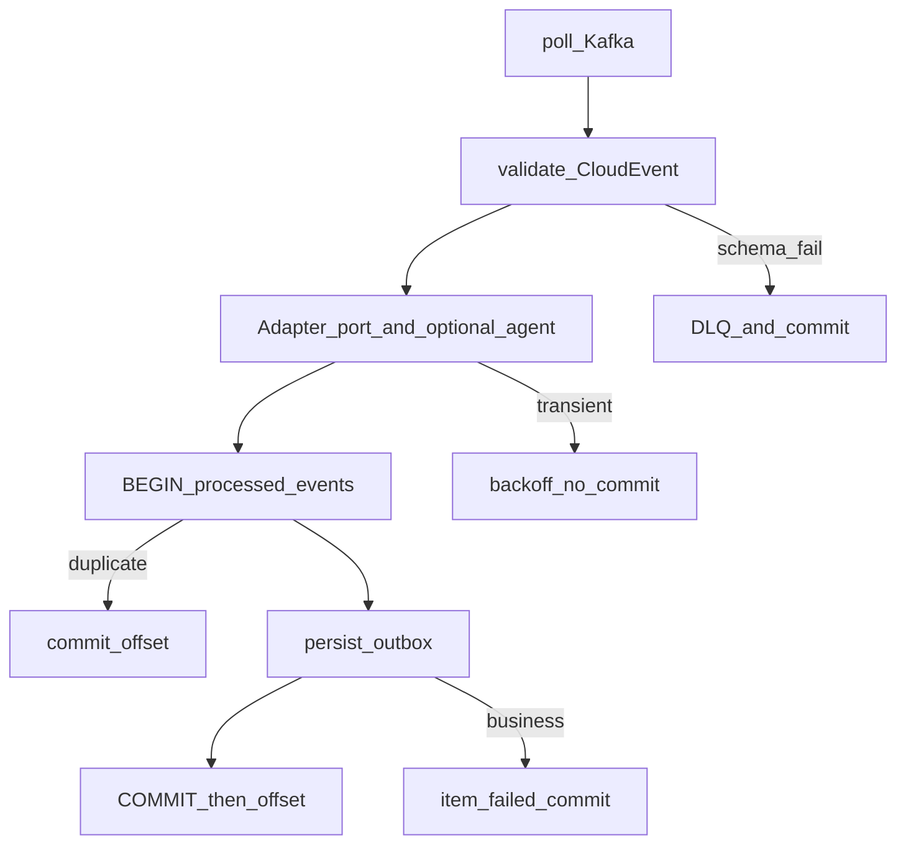
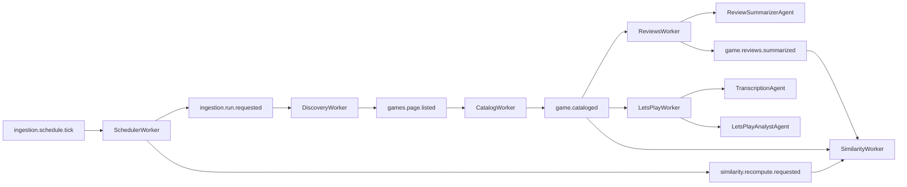

# Worker Catalog

**Status**: Existing
**Last Updated**: 2026-09-09
**Stakeholders**: AI Engineer, Backend
**Related Docs**: [../core/system-architecture.md](../core/system-architecture.md), [../core/configuration.md](../core/configuration.md), [replicas-and-idempotency.md](replicas-and-idempotency.md), [similarity.md](similarity.md), [../agents/agent-catalog.md](../agents/agent-catalog.md), [../events/event-contracts.md](../events/event-contracts.md), [../reliability/error-handling.md](../reliability/error-handling.md), [../integrations/adapters.md](../integrations/adapters.md), [../integrations/scraping-resilience.md](../integrations/scraping-resilience.md)

## Purpose

Каталог **автономных Python-демонов** (воркеров). Воркер — долгоживущий процесс: читает свои Kafka-события, делает детерминированную работу, пишет срез в PostgreSQL и следующее событие в outbox. Воркеры не знают друг о друге и не вызывают соседей.

LangGraph/LLM внутри воркера **нет**, кроме двух точек, где без модели нельзя: резюме отзывов и анализ летсплея. Там воркер вызывает локальный агент как библиотеку. См. [agent-catalog.md](../agents/agent-catalog.md).

## Key Principles

- Демон = Python consumer loop.
- Внешний HTTP только через типизированный Port (`packages/adapters`).
- Идемпотентность: unique `event_id` + `idempotency_key`. Реплики — [replicas-and-idempotency.md](replicas-and-idempotency.md).
- Commit Kafka offset после COMMIT БД.
- Имена топиков, group, cron, лимиты — [configuration.md](../core/configuration.md).
- Агент, если вызван, не читает Kafka и не ходит на Metacritic/YouTube.

## Components & Interactions

Общий цикл демона:

Consumer group и `type` исходящих событий — из конфига (`kafka.consumer_groups.*`, `kafka.events.*`). `source`: `urn:{app.name}:worker:{worker_type}`.

Реплики одного типа делят group; `instance_id` разный. Kafka одной group **не** гарантирует ровно один раз — см. replicas.

---

### Component: SchedulerWorker

**Kind**: daemon (без ИИ)

**Responsibility**: По cron или ручному тику решить source/page и опубликовать `ingestion.run.requested`.

**Interfaces**: consume event из `kafka.events.schedule_tick`; produce `kafka.events.run_requested` и по cron `kafka.events.similarity_recompute` (`scope=all`).

**Dependencies**: `ingestion_cursors`, `ingestion_runs`. Нет адаптеров сайтов, нет LLM. По `similarity.full_recompute_cron` публикует `similarity.recompute.requested` (`scope=all`).

**Scaling**: 1 или N; при N — advisory lock + unique run. `tick_source` и `tick_cron` — конфиг. Канон: внешний одиночный cron.

**Failure Modes**: гонка за ту же страницу → unique, retry на следующую. См. [error-handling.md](../reliability/error-handling.md).

Правило source (cron и Run now одно и то же): нет claimed `new_releases` за `process_date` → new_releases (`scheduler.default_limit`, 20 популярных); иначе browse `max(last_browse_page, in-flight/completed browse)+1`. Failed не резервирует страницу. Интервал тика = `scheduler.tick_cron` / interval, не хардкод «раз в час».

---

### Component: DiscoveryWorker

**Kind**: daemon

**Responsibility**: Listing: New Releases до `discovery.list_limit` (20), browse — все карточки страницы до `discovery.browse_list_limit` (48; на Metacritic ~24). Отфильтровать уже взятые сегодня, черновики `games`, одно `games.page.listed`.

**Interfaces**: consume `ingestion.run.requested`; produce `games.page.listed`.

**Dependencies**: MetacriticPort `canary_parse`, `list_new_releases` / `list_browse_page`.

**Scaling**: обычно 1; 2+ безопасны (unique slug/day + group). Топик run — `kafka.partitions.control`.

**Failure Modes**: listing timeout / `circuit_open` — retry, курсор не двигать; `parse_error` — fail-closed, курсор не двигать, P0; пустая страница при маркерах на месте — курсор +1, run completed; все slug уже сегодня — курсор +1.

Ключ: `run_id`. Пишет `daily_processed_slugs`. Canary не пишет slug в сутки.

---

### Component: CatalogWorker

**Kind**: daemon

**Responsibility**: Карточки всей страницы listing в одном Kafka-сообщении (один task/trace).

**Interfaces**: consume `games.page.listed`; produce `game.cataloged` на каждую успешную карточку (новый `traceparent` на событие).

**Dependencies**: MetacriticPort `get_game`; CoverStorage.

**Scaling**: страница — control-топик, одно сообщение обрабатывает одна реплика. Идемпотентность по ключу операции. Браузер не в реплике — общий sidecar.

**Failure Modes**: 404 одной игры — item failed, остальные карточки страницы продолжают; нет видео или обложка не скачалась — null + warning, completed; timeout listing-sidecar — retry всей страницы.

Срез: title, cover (локальный URL), publisher, genres, release_date, developer, description, video_url, platforms+scores. Чужие колонки (reviews/letsplay) не трогает.

---

### Component: ReviewsWorker

**Kind**: daemon + локальный агент

**Responsibility**: Скачать отзывы (детерминированно), затем получить резюме от агента.

**Interfaces**: consume `game.cataloged`; produce `game.reviews.summarized`.

**Dependencies**: MetacriticPort `get_critic_reviews`, `get_user_reviews`; `ReviewSummarizerAgent`.

**Scaling**: N реплик, `partitions.game_events >= N`. Идемпотентность по ключу операции.

Поток:

1. Port: батчи отзывов (уже урезанные). Critic и user запрашиваются **последовательно**. Таймаут одной стороны не хоронит другую: если есть хотя бы один батч, агент вызывается; если обе стороны timeout — Transient retry.
2. Пустые батчи → `degraded=true`, пустые summary, **агент не вызывается**.
3. Иначе `ReviewSummarizerAgent.invoke(critic_snippets, user_snippets)` → structured `ReviewSummary` × 2.
4. Persist + outbox.

Воркер не собирает промпт и не парсит свободный текст модели.

---

### Component: LetsPlayWorker

**Kind**: daemon + локальные агенты

**Responsibility**: Найти популярный летсплей, получить текст, сделать заключение.

**Interfaces**: consume `game.cataloged`; produce `game.letsplay.analyzed`.

**Dependencies**: YouTubePort `search_letsplays`, `get_transcript`; при отсутствии субтитров — `get_audio` + `TranscriptionAgent` (если STT включён); `LetsPlayAnalystAgent`.

**Scaling**: N реплик, `partitions.game_events >= N`. Идемпотентность по ключу операции.

Поток:

1. YouTubePort поиск (уже отфильтрованный и отсортированный). Взять `items[0]`.
2. Нет роликов → `status=no_video`, агенты не вызываются.
3. `get_transcript`. Если `ok` — текст готов.
4. Если `transcript_unavailable` и STT включён — `get_audio` + `TranscriptionAgent` (SttPort: OpenAI Whisper API). Временный клип yt-dlp (`gi-yt-audio-*`) удаляется после STT. Иначе `status=transcript_unavailable`, без заключения.
5. При наличии текста — `LetsPlayAnalystAgent` → `conclusion`, `highlights`.
6. Persist + outbox.

---

### Component: SimilarityWorker

**Kind**: daemon (эмбеддинг — одноразовый вызов модели, не агент)

**Responsibility**: Hybrid kNN похожих игр из своей БД; обновлять **свои и чужие** списки при росте каталога.

**Interfaces**: consume `game.cataloged`, `game.reviews.summarized`, `similarity.recompute.requested`; produce `game.similar.assigned` (и в incremental — `similarity.recompute.requested` для neighbors).

**Dependencies**: embedding adapter, pgvector. Нет сайта, нет LangGraph.

**Scaling**: N реплик, `partitions.game_events >= N`. Full recompute — `partitions.control`.

Полный алгоритм, hybrid-веса, hash, inline_all vs incremental, HNSW-порог: [similarity.md](similarity.md).

Кратко: default `inline_all` пересчитывает `similar_games` для всего корпуса с эмбеддингом, чтобы новичок сразу появился в чужих карточках. Пустой корпус → пустой список, completed.

---

### Сводка: демон vs агент

| Процесс | Kafka | Adapter | LLM/LangGraph |
|---------|-------|---------|---------------|
| SchedulerWorker | да | нет | нет |
| DiscoveryWorker | да | Metacritic | нет |
| CatalogWorker | да | Metacritic + media | нет |
| ReviewsWorker | да | Metacritic | вызывает ReviewSummarizer |
| LetsPlayWorker | да | YouTube | вызывает Transcription (opt) + Analyst |
| SimilarityWorker | да | embedding | OpenRouter embeddings, без агента |
| Query API / cron / sidecar / outbox relay | — | sidecar сам | нет |

## Diagrams / Visuals

Стрелки к агентам — in-process вызов, не Kafka.

## Trade-offs & Justifications

Детерминированный скрейпинг и SQL выполняет демон. Агент вызывается in-process из Reviews и LetsPlay. Реплики — [replicas-and-idempotency.md](replicas-and-idempotency.md). Similarity — [similarity.md](similarity.md).

## Technical Details

- **Technology Stack**: Python 3.12, Kafka consumer, adapter ports, SQLAlchemy; LangGraph только у Reviews/LetsPlay.
- **Configuration & Env Vars**: [configuration.md](../core/configuration.md).
- **Dependencies & Versions**: Scheduler/Discovery/Catalog/Similarity без langchain.
- **Testing Strategy**: handler + fake Port; повтор события и параллельный второй handler; inline_all взаимные соседи.
- **Deployment Considerations**: реплики Compose; общий consumer group; разный instance_id; один scrape sidecar.

## Quality Attributes

Автономность демонов, минимальная поверхность ИИ, предсказуемый control flow, изоляция сбоев по игре.
